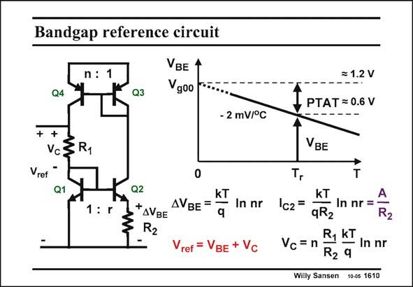

# SANSEN-1610 · Bandgap reference circuit

章节：16 带隙基准与电流基准电路  
PDF 页：452；书本页：461；幻灯片编号：1610  
状态：unreviewed



## 对应教材讲解

### PDF 452 · 书本 461

Remember that both transistor currents I must be C made equal. This can be achieved by another current mirror on top. Moreover, this pnp current mirror can be used to add another current ratio n. The result is that now both DV and the currents BE are PTAT, with a factor nr. The added voltage V is C then easily found to be PTAT and proportional to a resistor ratio, which can now be accurately attained. The reference voltage is now the sum of both. It can be trimmed by adjusting resistor R . The 1 resulting value will be around 1.2 V. Two more specifications are important in such a bandgap reference. The first one is the output impedance. It indicates if current can be pulled out from the reference. For this purpose an

### PDF 453 · 书本 462

emitter follower is usually added, or an additional current mirror, as illustrated in the realizations later on. The other characteristic is the output noise. Since this reference voltage is probably used to bias a number of circuits, its output noise risks entering the circuitry. This has to be avoided.

## 公式／性能结论候选摘录

以下为规则截取的原文，尚未逐项判读。

- PDF 452: Remember that both transistor currents I must be C made equal.
- PDF 452: The added voltage V is C then easily found to be PTAT and proportional to a resistor ratio, which can now be accurately attained.

## 曲线结论候选摘录

以下为规则截取的原文，尚未逐项判读。

- PDF 453: The other characteristic is the output noise.

## 原文条件与近似候选摘录

以下为规则截取的原文，尚未逐项判读。

（未由规则找到；不代表原页没有此类内容。）

## 幻灯片 OCR（未校正）

```text
Bandgap reference circuit
VBE
n: 1
Q4
Q3
Vgoo
- 2 mV/°C
+ +
V3R1
Vref
Q1
1: r
Q2
*AVBE
kT
AVBE =
In nr
R2
ref = VBE + Vc
= 1.2 V
1 PTAT= 0.6 v
VBE
T
KT
Ic2=
In nr =
qR2
R2
Vc = n
R, KT
In nr
R2 9
Willy Sansen 10-05 1610
```

数学上下标、分数及正负号以原图为准。电路图已保留；未核对的连接不输出成可仿真 netlist。
