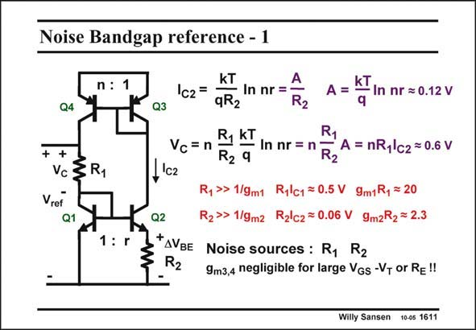

# SANSEN-1611 · Noise Bandgap reference - 1

章节：16 带隙基准与电流基准电路  
PDF 页：453；书本页：462；幻灯片编号：1611  
状态：unreviewed



## 对应教材讲解

### PDF 453 · 书本 462

The main question with respect to noise, is whether to use large currents with small resistors or vice-versa. The expressions for the current and the added voltage V are repeated in this C slide. Parameter A is introduced to shorten the writing. It is about 0.12 V, corresponding to a nr product of 100. The voltage V is still C about 0.6 V. The main noise sources are the two npn transistors Q1 and Q2, and the two resistors R and R . The noise contributions of the resistors dominate 1 2 because they are larger than the 1/g values of the transistors. m The noise of the top transistors Q4 and Q5 can be neglected by proper choice of their V −V GS T or by addition of series resistors. It is clear that by choosing larger currents, the resistors must be smaller. Is this advantageous for the output noise voltage?

## 公式／性能结论候选摘录

以下为规则截取的原文，尚未逐项判读。

（未由规则找到；不代表原页没有此类内容。）

## 曲线结论候选摘录

以下为规则截取的原文，尚未逐项判读。

（未由规则找到；不代表原页没有此类内容。）

## 原文条件与近似候选摘录

以下为规则截取的原文，尚未逐项判读。

- PDF 453: The noise contributions of the resistors dominate 1 2 because they are larger than the 1/g values of the transistors. m The noise of the top transistors Q4 and Q5 can be neglected by proper choice of their V −V GS T or by addition of series resistors.

## 幻灯片 OCR（未校正）

```text
Noise Bandgap reference - 1
n : 1
Q4
+
+
Vc 3 R1
Vref
@1.
1: r
Q3
kT
Ic2 =
- In nr =
qR2
A = Kl In nr = 0.12 V
R2
Vc=n
R, KT
R1
R2 9
In nr= П R2
A = nR1\c2 =0.6 V
,'cz
R,»> 1/9mt Ryc1 =0.5 V 9m1R, = 20
Q2
R2» 1/9m2 R2lc2=0.06 V 9m2R2 =2.3
+AVBE Noise sources: R1 R2
R2
9m3,4 negligible for large VGs -VT or Re!!
Willy Sansen
10-05 1611
```

数学上下标、分数及正负号以原图为准。电路图已保留；未核对的连接不输出成可仿真 netlist。
