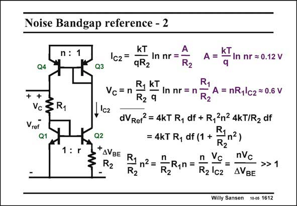

# SANSEN-1612 · Noise Bandgap reference - 2

章节：16 带隙基准与电流基准电路  
PDF 页：453；书本页：462；幻灯片编号：1612  
状态：unreviewed



## 对应教材讲解

### PDF 453 · 书本 462

The equivalent input noise voltage due to the two resistors is given in this slide. The voltage noise of resistor R appears directly in 1 series with the output. The noise of the other resistor R 2 is transformed towards the output by the resistor ratio and factor n. Its contribution to the output is a lot larger than that of resistor R . 1 Actually, the noise of R 2 is amplified to the output whereas the noise of R is 1 not. How can the output noise then be minimized?

## 公式／性能结论候选摘录

以下为规则截取的原文，尚未逐项判读。

（未由规则找到；不代表原页没有此类内容。）

## 曲线结论候选摘录

以下为规则截取的原文，尚未逐项判读。

（未由规则找到；不代表原页没有此类内容。）

## 原文条件与近似候选摘录

以下为规则截取的原文，尚未逐项判读。

（未由规则找到；不代表原页没有此类内容。）

## 幻灯片 OCR（未校正）

```text
Noise Bandgap reference - 2
n : 1
Q4
++
vc §R1
Vref
Q1.
1: r
Q3
kT
Ic2=
— In nr =-
qR2
R2
A= aIn nr =0.12v
R1
Vc=n
R1 KI In nr = 1 R2
A = nR1\c2 =0.6 V
R2 9
c2
dVRer? = 4kT R, df + R, 2n2 4kT/R2 df
Q2
= 4KT R, df (1 + Fna)
*AVBE R1n2=
R2
R2
IR,n =
R2
nvc
> 1
R2'c2
Willy Sansen 10-05 1612
```

数学上下标、分数及正负号以原图为准。电路图已保留；未核对的连接不输出成可仿真 netlist。
