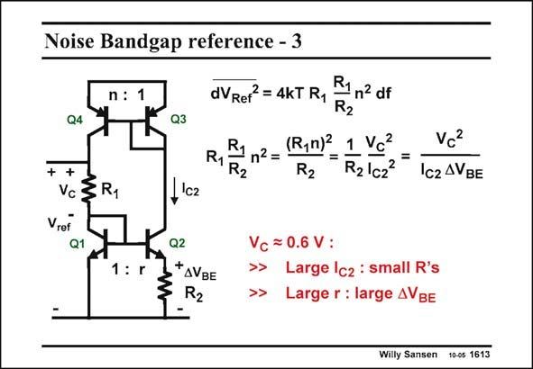

# SANSEN-1613 · Noise Bandgap reference - 3

章节：16 带隙基准与电流基准电路  
PDF 页：454；书本页：463；幻灯片编号：1613  
状态：unreviewed



## 对应教材讲解

### PDF 454 · 书本 463

If we neglect the noise of R 1 and only focus on the noise generated by R , we find 2 that only two parameters play a role. We find that V C is always about 0.6 V. The first one is I . The C2 larger we make the current I , the smaller resistor R C2 2 becomes, and the smaller its noise at the output. The other parameter is DV . A large voltage BE difference DV will require BE a large value of r, but will reduce the output noise. With this respect, it is better to use a large value of r, than a large value of n.

## 公式／性能结论候选摘录

以下为规则截取的原文，尚未逐项判读。

（未由规则找到；不代表原页没有此类内容。）

## 曲线结论候选摘录

以下为规则截取的原文，尚未逐项判读。

（未由规则找到；不代表原页没有此类内容。）

## 原文条件与近似候选摘录

以下为规则截取的原文，尚未逐项判读。

- PDF 454: If we neglect the noise of R 1 and only focus on the noise generated by R , we find 2 that only two parameters play a role.

## 幻灯片 OCR（未校正）

```text
Noise Bandgap reference - 3
n : 1
Q4
++
Vc 3R1
Vref
1: r
dVRer = 4kT R,
R1n2 df
R2
Q3
(R,n)2
1 Vđ
vc2
R1R2
R1 n2=
=
R2
R2Icz=
Ic2 AVBE
I'c2
Q2
*AVBE
R2
Vc = 0.6 V :
>>
Large Icz : small R's
Large r : large AVBE
Willy Sansen 10-05 1613
```

数学上下标、分数及正负号以原图为准。电路图已保留；未核对的连接不输出成可仿真 netlist。
