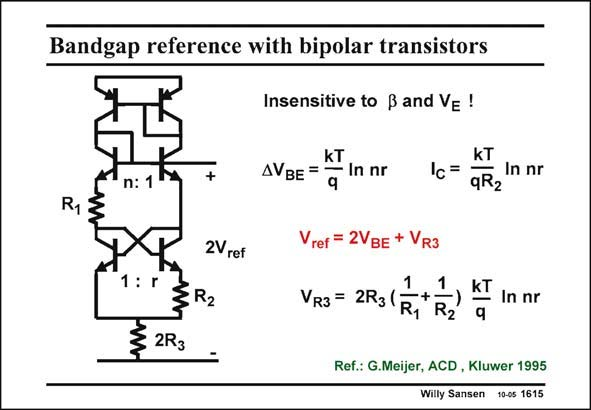

# SANSEN-1615 · Bandgap reference with bipolar transistors

章节：16 带隙基准与电流基准电路  
PDF 页：455；书本页：464；幻灯片编号：1615  
状态：unreviewed



## 对应教材讲解

### PDF 455 · 书本 464

One of the problems of bipolar current mirrors is that some of the precision is lost because of base currents and output resistances. Moreover, mismatch between the bipolar device sizes leads to offset, and causes error voltages. In this realization, these errors are avoided. The pnp current mirrors on top are is series with npn devices. Also, a double reference voltage is taken to reduce the effect of mismatch. Its output voltage is therefore about 2.4 V.

## 公式／性能结论候选摘录

以下为规则截取的原文，尚未逐项判读。

- PDF 455: Its output voltage is therefore about 2.4 V.

## 曲线结论候选摘录

以下为规则截取的原文，尚未逐项判读。

（未由规则找到；不代表原页没有此类内容。）

## 原文条件与近似候选摘录

以下为规则截取的原文，尚未逐项判读。

（未由规则找到；不代表原页没有此类内容。）

## 幻灯片 OCR（未校正）

```text
Bandgap reference with bipolar transistors
Insensitive to ß and Ve !
n: 1
+
KT
AVBE =
- In nr
KT
lc=.
In nr
9K2
R1
2Vref
:r
≤ 2R3
: R2
Vref = 2VBE + VR3
R3 = 2R3 (
R1
R2
KT
In nr
q
Ref.: G.Meijer, ACD , Kluwer 1995
Willy Sansen 10-05 1615
```

数学上下标、分数及正负号以原图为准。电路图已保留；未核对的连接不输出成可仿真 netlist。
