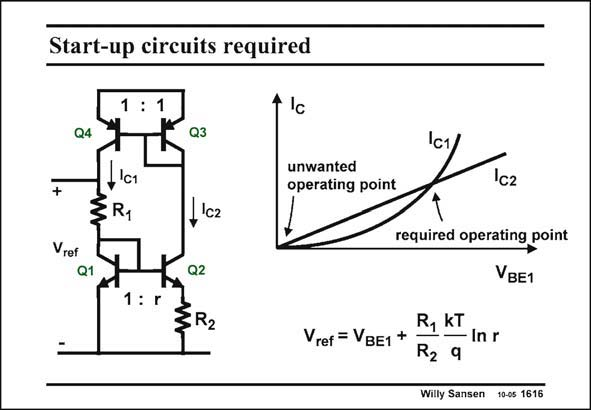

# SANSEN-1616 · Start-up circuits required

章节：16 带隙基准与电流基准电路  
PDF 页：455；书本页：464；幻灯片编号：1616  
状态：unreviewed



## 对应教材讲解

### PDF 455 · 书本 464

Such a bandgap reference based on two current mirrors has two operating points. A zero current is also perfectly possible. This circuit does not start by itself. The two operating points are found by plotting the two currents versus the common voltage V . The BE1 current of transistor Q2 is more linear as it has a feedback resistor R . 2 The top current mirror has unity gain. The operating points are now found at the crossings of the lines. Zero current works as well as the required operating point. Startup circuits are therefore required.

## 公式／性能结论候选摘录

以下为规则截取的原文，尚未逐项判读。

- PDF 455: The BE1 current of transistor Q2 is more linear as it has a feedback resistor R . 2 The top current mirror has unity gain.
- PDF 455: Startup circuits are therefore required.

## 曲线结论候选摘录

以下为规则截取的原文，尚未逐项判读。

- PDF 455: The two operating points are found by plotting the two currents versus the common voltage V .

## 原文条件与近似候选摘录

以下为规则截取的原文，尚未逐项判读。

（未由规则找到；不代表原页没有此类内容。）

## 幻灯片 OCR（未校正）

```text
Start-up circuits required
1:1
Q4
+
1lc1
ERI
Vref
• lc
unwanted
operating point
Q1
I'c2
Q2
1:r
ZR2
Vref = VBE1 +
c2
required operating point
VBE1
R, KT
— In r
R2 9
Willy Sansen 100s 1616
```

数学上下标、分数及正负号以原图为准。电路图已保留；未核对的连接不输出成可仿真 netlist。
