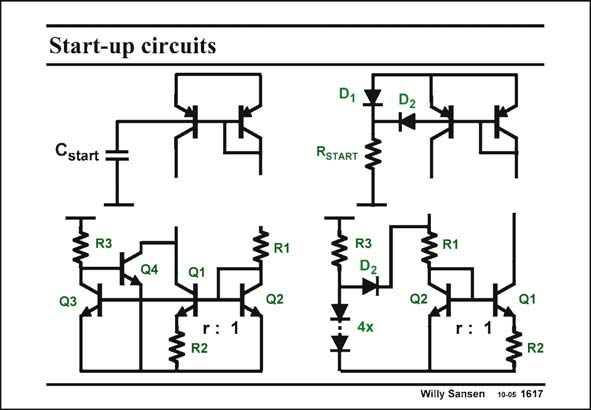

# SANSEN-1617 · Start-up circuits

章节：16 带隙基准与电流基准电路  
PDF 页：456；书本页：465；幻灯片编号：1617  
状态：unreviewed



## 对应教材讲解

### PDF 455 · 书本 464

A few simple startup circuits are shown in this slide. A capacitance at the base of the pnp current mirror draws a current when the supply voltage is switched on. This current flows through the pnp transistors and starts injecting a current in the bottom npn transistors as well, biasing up the bandgap reference circuit. However, if for some other reason the current drops to zero, then the supply voltage has to be switched on and off again.

### PDF 456 · 书本 465

The other circuit is better with this respect. When the supply voltage is switched on, diode D is forward 2 biased, drawing current through the pnp transistors, and biasing up the total circuit. However, the current also starts flowing through resistor R .The voltage start across this resistor increases until about 0.7 V below the supply voltage. Diode D is 2 then reverse biased, and disconnected from the actual bandgap circuit. In this way the currents in the bandgap are not disturbed. A similar arrangement with diodes is shown below. The startup circuit below left is different. When the supply voltage is turned on, transistor Q4 starts drawing current, biasing up the bandgap reference. This circuit on its turn drives Q3, which switches Q4 off again. As a result transistor Q4 does not influence the current balance in the bandgap circuit.

## 公式／性能结论候选摘录

以下为规则截取的原文，尚未逐项判读。

- PDF 456: However, the current also starts flowing through resistor R .The voltage start across this resistor increases until about 0.7 V below the supply voltage.
- PDF 456: As a result transistor Q4 does not influence the current balance in the bandgap circuit.

## 曲线结论候选摘录

以下为规则截取的原文，尚未逐项判读。

（未由规则找到；不代表原页没有此类内容。）

## 原文条件与近似候选摘录

以下为规则截取的原文，尚未逐项判读。

（未由规则找到；不代表原页没有此类内容。）

## 幻灯片 OCR（未校正）

```text
Start-up circuits
Cstart
Q4
Q1
r: 1
R1
D1
RSTART <
D2
R1
Q1
r:
3 R2
Willy Sansen 10-05 1617
```

数学上下标、分数及正负号以原图为准。电路图已保留；未核对的连接不输出成可仿真 netlist。
