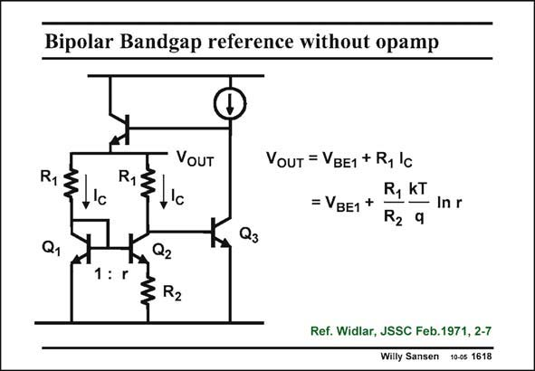

# SANSEN-1618 · Bipolar Bandgap reference without opamp

章节：16 带隙基准与电流基准电路  
PDF 页：456；书本页：465；幻灯片编号：1618  
状态：unreviewed



## 对应教材讲解

### PDF 456 · 书本 465

One of the first bandgap references is shown in this slide. The PTAT current generator Q1-Q2-R2 provides a PTAT voltage across resistor R1. This voltage is added to the V of transistor Q1, BE1 towards a bandgap reference voltage indeed. Again, the output impedance is low, because an emitter follower is used to close the feedback loop at the output.

## 公式／性能结论候选摘录

以下为规则截取的原文，尚未逐项判读。

（未由规则找到；不代表原页没有此类内容。）

## 曲线结论候选摘录

以下为规则截取的原文，尚未逐项判读。

（未由规则找到；不代表原页没有此类内容。）

## 原文条件与近似候选摘录

以下为规则截取的原文，尚未逐项判读。

（未由规则找到；不代表原页没有此类内容。）

## 幻灯片 OCR（未校正）

```text
Bipolar Bandgap reference without opamp
RIS
a, )
VOUT
RIS
,'c
1,02
1: r
3 R2
VouT = VBE1 + R, lc
=VBE1+
R, KT
— In r
R2 9
Kx Q3
Ref. Widlar, JSSC Feb. 1971, 2-7
Willy Sansen 10-05 1618
```

数学上下标、分数及正负号以原图为准。电路图已保留；未核对的连接不输出成可仿真 netlist。
