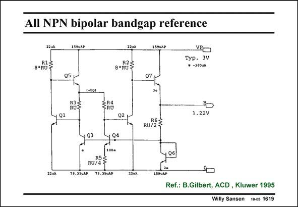

# SANSEN-1619 · AIl NPN bipolar bandgap reference

章节：16 带隙基准与电流基准电路  
PDF 页：457；书本页：466；幻灯片编号：1619  
状态：unreviewed



## 对应教材讲解

### PDF 456 · 书本 465

An all-npn realization of a bandgap circuit is given in this slide. It is less simple but highly symmetrical. Many error terms as a result of too low beta’s, output resistances, etc. are cancelled. A ratio of 100 is used between the sizes of Q3 and Q4, giving a fairly large DV (of about BE

### PDF 457 · 书本 466

120 mV). This is good for low sensitivity to offset and noise. The currents are indicated for RU=6 kV. The currents in both transistors are kept the same because of the equal feedback networks Q1-R1-Q5 and Q2-R2-Q7. The emitters of Q5 and Q7 are therefore at the same voltage, which is the bandgap voltage. Indeed, resistor R6 can here be tuned to provide the exact bandgap voltage of 1.22 V. What is also obviously is the sum of the V BE of transistor Q6 and the voltage V across resistor R6. C A low output impedance is obtained because of the use of emitter followers and feedback. The curvature can be compensated by putting a resistor RU across Q6 and addition of another emitter follower at the output, which lowers the output voltage to about 0.4 V (not shown).

## 公式／性能结论候选摘录

以下为规则截取的原文，尚未逐项判读。

- PDF 456: Many error terms as a result of too low beta’s, output resistances, etc. are cancelled.
- PDF 457: The currents in both transistors are kept the same because of the equal feedback networks Q1-R1-Q5 and Q2-R2-Q7.
- PDF 457: The emitters of Q5 and Q7 are therefore at the same voltage, which is the bandgap voltage.

## 曲线结论候选摘录

以下为规则截取的原文，尚未逐项判读。

（未由规则找到；不代表原页没有此类内容。）

## 原文条件与近似候选摘录

以下为规则截取的原文，尚未逐项判读。

（未由规则找到；不代表原页没有此类内容。）

## 幻灯片 OCR（未校正）

```text
AIl NPN bipolar bandgap reference
22ul
8-RUE
159UAP
32uл
8+RUE
VPO
Tур. 3V
• -360UA
Q7 +
RUS
<RU
Q2
1.22V
RU/ES
Q3
04
79.330AP
RUPSS
79.33uл₽
22v2
159UAP|
Ref.: B.Gilbert, ACD , Kluwer 1995
Willy Sansen 1005 1619
```

数学上下标、分数及正负号以原图为准。电路图已保留；未核对的连接不输出成可仿真 netlist。
