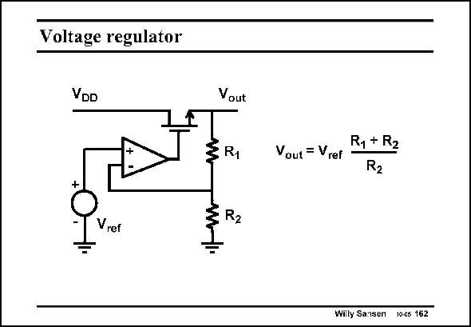

# SANSEN-162 · Voltage regulator

章节：16 带隙基准与电流基准电路  
PDF 页：448；书本页：457；幻灯片编号：162  
状态：unreviewed



## 对应教材讲解

### PDF 448 · 书本 457

First of all, we have to look at what voltage references are actually used for. They are used in Analogto-digital converters. They can also be used in both voltage and current regulators. Both schematics are given. A voltage regulator locks the output voltage to the reference voltage by use of a resistor ratio. Actually it is a two-stage feedback amplifier, with the reference voltage V as an input. The first ref stage is the opamp, whereas the second stage is a source follower. This follower can deliver a large current to the load, depending on its W/L ratio. The load is not shown. It is usually a combination of resistances and capacitances, which can vary over a very wide range, depending on the current drawn from the regulator. The supply voltage V usually contains a ripple, which will be suppressed by the regulator. DD The accuracy of the output voltage depends on the accuracy of the resistor ratio and the absolute accuracy of the reference voltage. This resistor ratio can have a smaller error than 0.1% (see Chapter 15), if they are large in area. The final accuracy will therefore depend on the absolute error of the reference voltage. We will see that this can also be 0.1%!

## 公式／性能结论候选摘录

以下为规则截取的原文，尚未逐项判读。

- PDF 448: This follower can deliver a large current to the load, depending on its W/L ratio.
- PDF 448: It is usually a combination of resistances and capacitances, which can vary over a very wide range, depending on the current drawn from the regulator.
- PDF 448: DD The accuracy of the output voltage depends on the accuracy of the resistor ratio and the absolute accuracy of the reference voltage.
- PDF 448: The final accuracy will therefore depend on the absolute error of the reference voltage.

## 曲线结论候选摘录

以下为规则截取的原文，尚未逐项判读。

（未由规则找到；不代表原页没有此类内容。）

## 原文条件与近似候选摘录

以下为规则截取的原文，尚未逐项判读。

（未由规则找到；不代表原页没有此类内容。）

## 幻灯片 OCR（未校正）

```text
Voltage regulator
VDD
Vout
ER1
Vref
§ R2
Vout = Vref
R1 + R2
R2
Willy Sansen 10cs 162
```

数学上下标、分数及正负号以原图为准。电路图已保留；未核对的连接不输出成可仿真 netlist。
