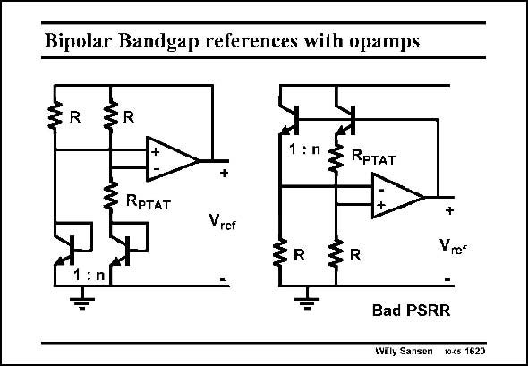

# SANSEN-1620 · Bipolar Bandgap references with opamps

章节：16 带隙基准与电流基准电路  
PDF 页：457；书本页：466；幻灯片编号：1620  
状态：unreviewed



## 对应教材讲解

### PDF 457 · 书本 466

Operational amplifiers can provide much more loop gain than a transistor pair. In this bandgap reference, the opamp finds an output voltage such that the differential input zero becomes zero. If the resistors R are chosen such that they take up about 0.6 V, then the output voltage is about 1.2 V. The output impedance is obviously very low, at least at low frequencies. The same applies to the bandgap reference on the right. Its PSRR is worse however because transistors are used, with their collectors connected to the power supply.

## 公式／性能结论候选摘录

以下为规则截取的原文，尚未逐项判读。

- PDF 457: Operational amplifiers can provide much more loop gain than a transistor pair.

## 曲线结论候选摘录

以下为规则截取的原文，尚未逐项判读。

（未由规则找到；不代表原页没有此类内容。）

## 原文条件与近似候选摘录

以下为规则截取的原文，尚未逐项判读。

（未由规则找到；不代表原页没有此类内容。）

## 幻灯片 OCR（未校正）

```text
Bipolar Bandgap references with opamps
ER
1 :п
≤ RpTAT
= RpTAT
Vref
+
Vref
:n
Bad PSRR
Willy Sansen 10c6 1620
```

数学上下标、分数及正负号以原图为准。电路图已保留；未核对的连接不输出成可仿真 netlist。
