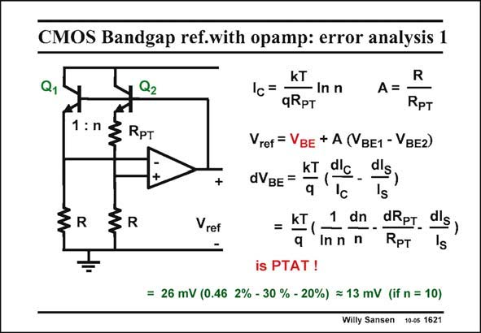

# SANSEN-1621 · CMOS Bandgap ref.with opamp: error analysis 1

章节：16 带隙基准与电流基准电路  
PDF 页：458；书本页：467；幻灯片编号：1621  
状态：unreviewed



## 对应教材讲解

### PDF 457 · 书本 466

What is the absolute tolerance that can be obtained with such a bandgap reference? For the circuit in this slide, the current and reference voltage are copied from before.

### PDF 458 · 书本 467

Two terms can be distinguished. The first one is V . BE The second term is ADV . BE This takes the first term on this slide. Taking the total derivative yields three terms, the first one of which is the smallest. The other two are comparable. When we add them we find about 13 mV error, for the numbers given. This error is PTAT however, and can be trimmed away.

## 公式／性能结论候选摘录

以下为规则截取的原文，尚未逐项判读。

（未由规则找到；不代表原页没有此类内容。）

## 曲线结论候选摘录

以下为规则截取的原文，尚未逐项判读。

（未由规则找到；不代表原页没有此类内容。）

## 原文条件与近似候选摘录

以下为规则截取的原文，尚未逐项判读。

（未由规则找到；不代表原页没有此类内容。）

## 幻灯片 OCR（未校正）

```text
CMOS Bandgap ref.with opamp: error analysis 1
Q1
Q2
1: n
3 RpT
R
+
Vref
kT
Ic=
- In n
A=
qRpT
R
Rpт
Vref = VBe + A (VBE1 - VвE2)
dlc
dVBE =
KT
q
KT
=
dn
In n
dls
's
dRpт.
RpT
dls
is PTAT!
= 26 mV (0.46 2% - 30 % - 20%) = 13 mV (if n = 10)
Willy Sansen 10-05 1621
```

数学上下标、分数及正负号以原图为准。电路图已保留；未核对的连接不输出成可仿真 netlist。
