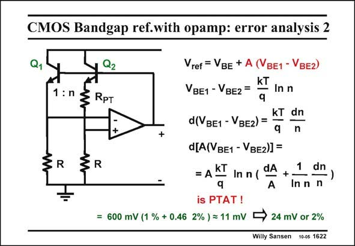

# SANSEN-1622 · CMOS Bandgap ref.with opamp: error analysis 2

章节：16 带隙基准与电流基准电路  
PDF 页：458；书本页：467；幻灯片编号：1622  
状态：unreviewed



## 对应教材讲解

### PDF 458 · 书本 467

Now we take the total derivative of the second term. The percentages are now smaller but the scaling factor is V rather than BE kT/q. The absolute value is therefore of the same order of magnitude. It is 11 mV for the numbers given. When we add both values we obtain 24 mV, which is about 2% of the bandgap reference voltage. It is PTAT gain and can therefore be trimmed by adjusting A for example. From this analysis, it is clear that the curvature is smaller than the error. Only if trimming is applied, must the curvature be compensated. Also, the offset of the opamp has not been taken into account. It has the same effect as a difference in V of the two transistors. However, this offset can be avoided by using chopper BE amplifiers.

## 公式／性能结论候选摘录

以下为规则截取的原文，尚未逐项判读。

- PDF 458: The absolute value is therefore of the same order of magnitude.
- PDF 458: It is PTAT gain and can therefore be trimmed by adjusting A for example.

## 曲线结论候选摘录

以下为规则截取的原文，尚未逐项判读。

（未由规则找到；不代表原页没有此类内容。）

## 原文条件与近似候选摘录

以下为规则截取的原文，尚未逐项判读。

- PDF 458: Only if trimming is applied, must the curvature be compensated.

## 幻灯片 OCR（未校正）

```text
CMOS Bandgap ref.with opamp: error analysis 2
Q1
1 :n
3 RpT
R
Q2
+
Vref = VBE + A (VBE1 - VвE2)
kT
VBE1 -VBE2 =
In n
kT dn
d(VBE1 - VBE2) =
9
n
d[A(VBe1 - VBE2)]=
R
= A KT
In n (dA +
1
dn
q
inn n
is PTAT !
= 600 mV (1 % + 0.46 2% ) = 11 mV
24 mV or 2%
Willy Sansen 10-0s 1622
```

数学上下标、分数及正负号以原图为准。电路图已保留；未核对的连接不输出成可仿真 netlist。
