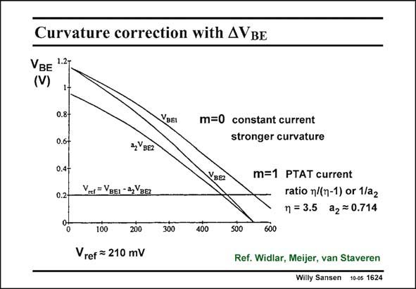

# SANSEN-1624 · Curvature correction with AVBE

章节：16 带隙基准与电流基准电路  
PDF 页：459；书本页：468；幻灯片编号：1624  
状态：unreviewed



## 对应教材讲解

### PDF 459 · 书本 468

Curvature correction is always possible, if needed. It is always based on taking two references with a different curvature. We have seen before that the curvature for a current which is independent of temperature (m=0) is larger than for a PTAT current (m=1). The ratio of the corresponding nonlinearity is about g/(g−1). This ratio is actually independent of the current levels used. A weighted addition of the output voltages then allows perfect compensation of the curvature. Curvature compensation is also possible in another way, as shown next.

## 公式／性能结论候选摘录

以下为规则截取的原文，尚未逐项判读。

- PDF 459: We have seen before that the curvature for a current which is independent of temperature (m=0) is larger than for a PTAT current (m=1).
- PDF 459: This ratio is actually independent of the current levels used.

## 曲线结论候选摘录

以下为规则截取的原文，尚未逐项判读。

（未由规则找到；不代表原页没有此类内容。）

## 原文条件与近似候选摘录

以下为规则截取的原文，尚未逐项判读。

（未由规则找到；不代表原页没有此类内容。）

## 幻灯片 OCR（未校正）

```text
Curvature correction with AVBE
VBE 127
(V)
0.8-
0.6-
0.4-
0.2-
VBaI
zY BEZ
m=0 constant current
stronger curvature
VBER
m=1 PTAT current
ratio n/(n-1) or 1/a2
n = 3.5 a2 = 0.714
Vrer=VBEI - 3,Yaa
100
200
Vref = 210 mV
300
400
500
600
Ref. Widlar, Meijer, van Staveren
Willy Sansen 10-cs 1624
```

数学上下标、分数及正负号以原图为准。电路图已保留；未核对的连接不输出成可仿真 netlist。
