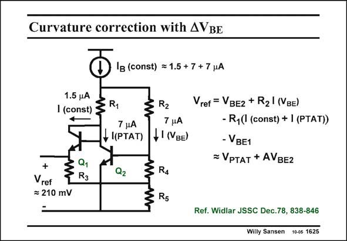

# SANSEN-1625 · Curvature correction with AVBE

章节：16 带隙基准与电流基准电路  
PDF 页：460；书本页：469；幻灯片编号：1625  
状态：unreviewed



## 对应教材讲解

### PDF 460 · 书本 469

Another way to provide curvature compensation is shown in this slide. Currents with three different temperature coefficients are available. The total current I is indepen- B dent on temperature. The expression shows that the reference voltage can also be made independent of temperature. Because it is a combination of currents with different m’s and different curvature, it can be made independent of curvature as well.

## 公式／性能结论候选摘录

以下为规则截取的原文，尚未逐项判读。

- PDF 460: The expression shows that the reference voltage can also be made independent of temperature.
- PDF 460: Because it is a combination of currents with different m’s and different curvature, it can be made independent of curvature as well.

## 曲线结论候选摘录

以下为规则截取的原文，尚未逐项判读。

（未由规则找到；不代表原页没有此类内容。）

## 原文条件与近似候选摘录

以下为规则截取的原文，尚未逐项判读。

（未由规则找到；不代表原页没有此类内容。）

## 幻灯片 OCR（未校正）

```text
Curvature correction with AVBE
O'E (const) =1,5+7+7,uA
1.5 4A
11.5m) R1
7 HA
4 ((PTAT)
R2
7 нA
fI(NBE)
• Q1
Vref = VBE2 + R2| (VBE)
- R,(( (const) + 1 (PTAT))
- VBE1
=VPTAT + AVBE2
Q2
: R4
Vref
= 210 mV
R5
Ref. Widlar JSSC Dec.78, 838-846
Willy Sansen 10-05 1625
```

数学上下标、分数及正负号以原图为准。电路图已保留；未核对的连接不输出成可仿真 netlist。
