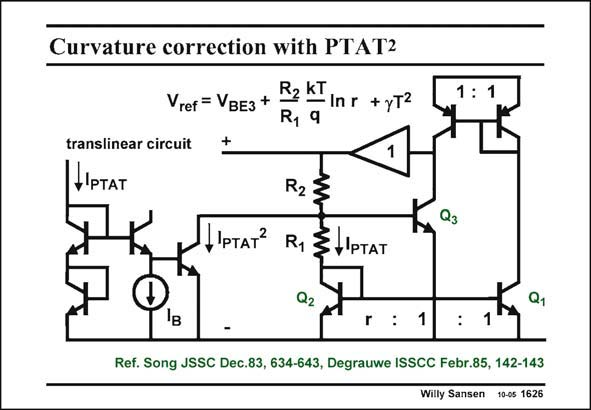

# SANSEN-1626 · Curvature correction with PTAT2

章节：16 带隙基准与电流基准电路  
PDF 页：460；书本页：469；幻灯片编号：1626  
状态：unreviewed



## 对应教材讲解

### PDF 460 · 书本 469

Another way to apply curvature correction is to inject a parabolic current. It has become clear from the earlier slides that the curvature error has a very strong parabolic shape. Injection of a current with an inverse parabolic shape must be able to correct the curvature. The derivation of a parabolic or second-order current is carried out by means of the translinear circuit on the left. All transistors work in the weak-inversion region where they have exponential current-voltage relationships. The sum of V ’s therefore translates in a product of currents. This technique is also used to bias the GS output transistors of many class-AB stages (see Chapter 12). A small fraction of the second-order PTAT current is then added to the bandgap voltage. This will now require a second trimming.

## 公式／性能结论候选摘录

以下为规则截取的原文，尚未逐项判读。

- PDF 460: The sum of V ’s therefore translates in a product of currents.

## 曲线结论候选摘录

以下为规则截取的原文，尚未逐项判读。

（未由规则找到；不代表原页没有此类内容。）

## 原文条件与近似候选摘录

以下为规则截取的原文，尚未逐项判读。

（未由规则找到；不代表原页没有此类内容。）

## 幻灯片 OCR（未校正）

```text
Curvature correction with PTAT2
R2 KT
Vref = VвEз+
- In r
+yT2
R, 9
+
1 : 1
translinear circuit
+IPTAT
IpTAт
R2
R1
3+ IPTAT
Q2
Q3
r : 1
Ref. Song JSSC Dec.83, 634-643, Degrauwe ISSCC Febr.85, 142-143
Willy Sansen 10-05 1626
```

数学上下标、分数及正负号以原图为准。电路图已保留；未核对的连接不输出成可仿真 netlist。
