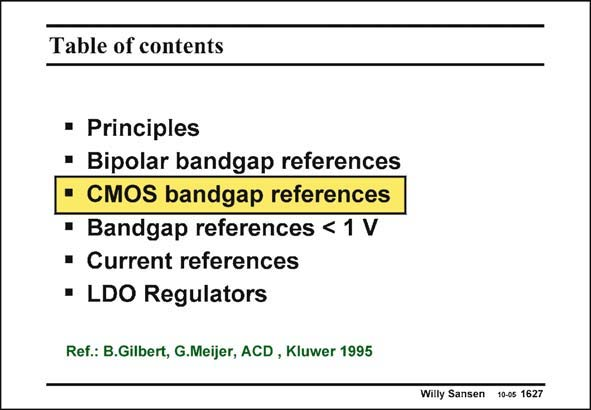

# SANSEN-1627 · Table of contents

章节：16 带隙基准与电流基准电路  
PDF 页：461；书本页：470；幻灯片编号：1627  
状态：unreviewed



## 对应教材讲解

### PDF 461 · 书本 470

The realization of bandgap reference voltages are not so obvious in CMOS technology. A bandgap voltage is essentially connected to a pn diode or rather to a diode connected transistor. This device must have a exponential and reproducible current-voltage characteristic. Such a device is not easily found in a CMOS technology.

## 公式／性能结论候选摘录

以下为规则截取的原文，尚未逐项判读。

（未由规则找到；不代表原页没有此类内容。）

## 曲线结论候选摘录

以下为规则截取的原文，尚未逐项判读。

- PDF 461: This device must have a exponential and reproducible current-voltage characteristic.

## 原文条件与近似候选摘录

以下为规则截取的原文，尚未逐项判读。

（未由规则找到；不代表原页没有此类内容。）

## 幻灯片 OCR（未校正）

```text
Table of contents
• Principles
• Bipolar bandgap references
• CMOS bandgap references
• Bandgap references < 1 V
• Current references
• LDO Regulators
Ref.: B.Gilbert, G.Meijer, ACD, Kluwer 1995
Willy Sansen 10-0s 1627
```

数学上下标、分数及正负号以原图为准。电路图已保留；未核对的连接不输出成可仿真 netlist。
