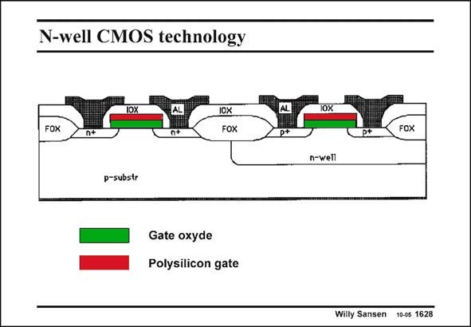

# SANSEN-1628 · N-well CMOS technology

章节：16 带隙基准与电流基准电路  
PDF 页：461；书本页：470；幻灯片编号：1628  
状态：unreviewed



## 对应教材讲解

### PDF 461 · 书本 470

In a n-well technology, both lateral npn and pnp transistors are easily found. They have very low beta’s, however. Moreover, the exponential current voltage characteristic is limited to a narrow range of currents. On the other hand, the vertical or substrate pnp transistor can also be used . Its base is the n-well and its collector is the common p-substrate. As a consequence, all their collectors are connected together. They cannot be used in a circuit unless the collector is connected to ground. Their beta’s are reasonable and their output resistances are very high.

## 公式／性能结论候选摘录

以下为规则截取的原文，尚未逐项判读。

- PDF 461: Moreover, the exponential current voltage characteristic is limited to a narrow range of currents.

## 曲线结论候选摘录

以下为规则截取的原文，尚未逐项判读。

- PDF 461: Moreover, the exponential current voltage characteristic is limited to a narrow range of currents.

## 原文条件与近似候选摘录

以下为规则截取的原文，尚未逐项判读。

（未由规则找到；不代表原页没有此类内容。）

## 幻灯片 OCR（未校正）

```text
N-well CMOS technology
lOX
FOX
n+
1OX
FOX
p-substr
Gate oxyde
Polysilicon gate
AL
p*
FOX
n-well
Willy Sansen 10-0s 1628
```

数学上下标、分数及正负号以原图为准。电路图已保留；未核对的连接不输出成可仿真 netlist。
