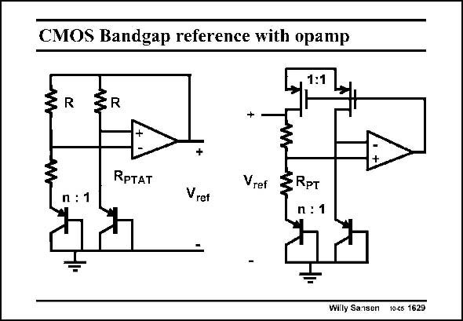

# SANSEN-1629 · CMOS Bandgap reference with opamp

章节：16 带隙基准与电流基准电路  
PDF 页：462；书本页：471；幻灯片编号：1629  
状态：unreviewed



## 对应教材讲解

### PDF 461 · 书本 470

Two realizations are shown in this slide. The collectors are connected to the substrate. It is obvious that both circuits are only possible in a n-well CMOS technology. This is no problem, as most CMOS technologies are n-well indeed. The same advantages apply as for the bipolar equivalents.

### PDF 462 · 书本 471

There is one important difference however. CMOS opamps have a larger offset. This means that they are only self-starting if the offset is right. Moreover, the offset gives a much larger error in the current equalization and therefore in the output voltage. The circuit on the right has again a worse PSRR.

## 公式／性能结论候选摘录

以下为规则截取的原文，尚未逐项判读。

- PDF 462: Moreover, the offset gives a much larger error in the current equalization and therefore in the output voltage.

## 曲线结论候选摘录

以下为规则截取的原文，尚未逐项判读。

（未由规则找到；不代表原页没有此类内容。）

## 原文条件与近似候选摘录

以下为规则截取的原文，尚未逐项判读。

- PDF 462: Moreover, the offset gives a much larger error in the current equalization and therefore in the output voltage.

## 幻灯片 OCR（未校正）

```text
CMOS Bandgap reference with opamp
RpTAT
Vref
RPT
Vret
Willy Sansen 10c6 1629
```

数学上下标、分数及正负号以原图为准。电路图已保留；未核对的连接不输出成可仿真 netlist。
