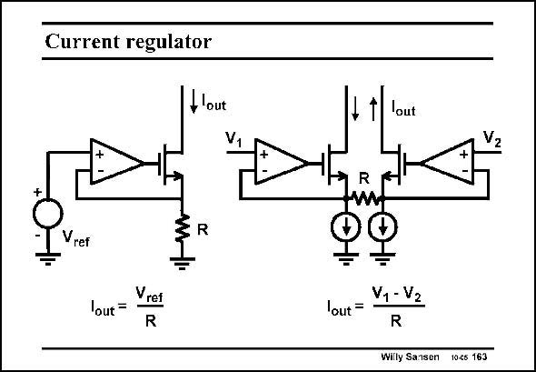

# SANSEN-163 · Current regulator

章节：16 带隙基准与电流基准电路  
PDF 页：449；书本页：458；幻灯片编号：163  
状态：unreviewed



## 对应教材讲解

### PDF 449 · 书本 458

A current regulator is easily derived from a voltage reference. A single-ended version is shown on the left; a differential one on the right. In both cases, the reference voltage is converted into a current by use of an opamp and a resistor. The absolute accuracy of the output current will depend on both the absolute accuracies of the voltage reference and of the resistor. The latter one is by far the worst. In the section on current references, several examples are given of which resistances can be used. However, the absolute accuracy will always be a problem.

## 公式／性能结论候选摘录

以下为规则截取的原文，尚未逐项判读。

- PDF 449: The absolute accuracy of the output current will depend on both the absolute accuracies of the voltage reference and of the resistor.

## 曲线结论候选摘录

以下为规则截取的原文，尚未逐项判读。

（未由规则找到；不代表原页没有此类内容。）

## 原文条件与近似候选摘录

以下为规则截取的原文，尚未逐项判读。

（未由规则找到；不代表原页没有此类内容。）

## 幻灯片 OCR（未校正）

```text
Current regulator
flout
V.
Vref
lout =
Vret
R
I 1 lout
R
W
lout =
V1 - V2
R
Willy Sansen
1o-cs 163
```

数学上下标、分数及正负号以原图为准。电路图已保留；未核对的连接不输出成可仿真 netlist。
