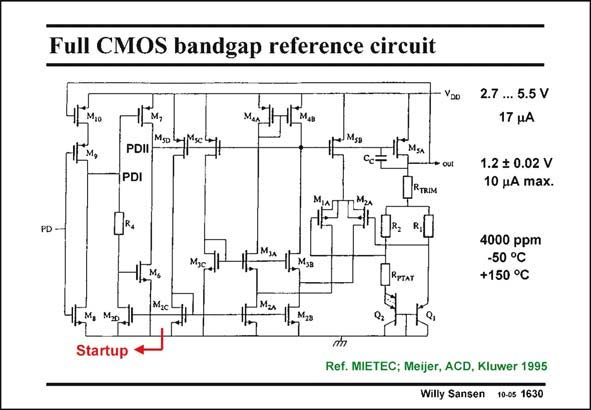

# SANSEN-1630 · Full CMOS bandgap reference circuit

章节：16 带隙基准与电流基准电路  
PDF 页：462；书本页：471；幻灯片编号：1630  
状态：unreviewed



## 对应教材讲解

### PDF 462 · 书本 471

A practical example of a bandgap reference is shown in this slide. The output voltage is trimmed to 1.2 V, with a variation of maximum 20 mV. The temperature coefficient is only 4000 ppm or 0.4% over a very wide temperature range, or 20 ppm/°C. The PTAT current is generated by transistors Q1/Q2 and resistor R . Resistors PTAT R and R are equal and 1 2 generate the output voltage, together with R , which TRIM is trimmed. The operational amplifier is a folded cascode, with M1/M2 as input devices and the Drains of M3B/M4B (point PDII) as output. They operate in weak inversion and are now quite large to suppress offset and 1/f noise. It is a two-stage amplifier. A compensation capacitance is therefore required. The startup circuit is on the left. It includes a Power-Down function. The Drain of transistor M7 (point PDII) biases the amplifier and the bandgap reference. There are two inverters between this point and PD, by means of transistors M8/M9 and M6/M7. When PD is high. The output of the first inverter is low (point PDI) and the output of the next inverter is high (point PDII). All pMOSTs connected at this point are thus off and so is the opamp and bandgap. The output is low.

### PDF 463 · 书本 472

When PD is low, point PDI is high and PDII is low, biasing all the pMOSTs. The output is regulated by the opamp. Current mirror M2C/M2D and resistor R4 clamp this situation even when PD disappears.

## 公式／性能结论候选摘录

以下为规则截取的原文，尚未逐项判读。

- PDF 462: Resistors PTAT R and R are equal and 1 2 generate the output voltage, together with R , which TRIM is trimmed.
- PDF 462: A compensation capacitance is therefore required.
- PDF 462: All pMOSTs connected at this point are thus off and so is the opamp and bandgap.

## 曲线结论候选摘录

以下为规则截取的原文，尚未逐项判读。

（未由规则找到；不代表原页没有此类内容。）

## 原文条件与近似候选摘录

以下为规则截取的原文，尚未逐项判读。

（未由规则找到；不代表原页没有此类内容。）

## 幻灯片 OCR（未校正）

```text
Full CMOS bandgap reference circuit
Yoo
PD -
PDII
PDI
FR.
1.м,
1Msa
2.7 ... 5.5 V
17 4A
1.2 $ 0.02 V
10 uA max.
"TIAT
4000 ppm
-50 °C
+150 °C
Startup
Ref. MIETEC; Meijer, ACD, Kluwer 1995
Willy Sansen 10-05 1630
```

数学上下标、分数及正负号以原图为准。电路图已保留；未核对的连接不输出成可仿真 netlist。
