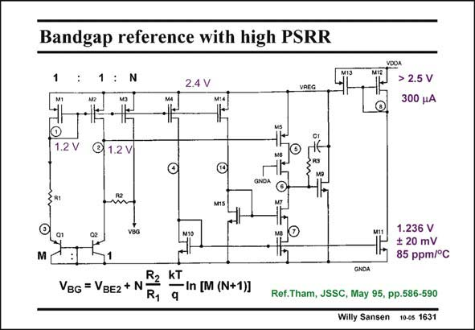

# SANSEN-1631 · Bandgap reference with high PSRR

章节：16 带隙基准与电流基准电路  
PDF 页：463；书本页：472；幻灯片编号：1631  
状态：unreviewed



## 对应教材讲解

### PDF 463 · 书本 472

In order to improve the Power-Supply-Rejection Ratio, an internal voltage regulator can be used, as shown in this slide. The bandgap reference itself is easily recognized on the left. The goal of the regulator is to ensure that nodes 1 and 2 are at exactly the same voltage. In this way, the PSRR is greatly improved. For this purpose, a twostage opamp is used with M5 as an input transistor and M9 as a second stage. As a result, the VREG is adjusted for maximum equality of the voltages at nodes 1 and 2. Clearly, M5 must be matched to M1. The PSRR is then −95 dB at 1 kHz and still −40 dB at 1 MHz.

## 公式／性能结论候选摘录

以下为规则截取的原文，尚未逐项判读。

- PDF 463: As a result, the VREG is adjusted for maximum equality of the voltages at nodes 1 and 2.

## 曲线结论候选摘录

以下为规则截取的原文，尚未逐项判读。

（未由规则找到；不代表原页没有此类内容。）

## 原文条件与近似候选摘录

以下为规则截取的原文，尚未逐项判读。

（未由规则找到；不代表原页没有此类内容。）

## 幻灯片 OCR（未校正）

```text
Bandgap reference with high PSRR
1
:N
2.4 V
VREG
VDDA
M12
> 2.5 V
300 pA
1.2 V
@ 1.2 V
M15
M
1.236 V
+ 20 mV
85 ppm/°C
VBG = VBE2 + N
R2
kT
- In [M (N+1)]
R1
GNDA
Ref.Tham, JSSC, May 95, pp.586-590
Willy Sansen 10-05 1631
```

数学上下标、分数及正负号以原图为准。电路图已保留；未核对的连接不输出成可仿真 netlist。
