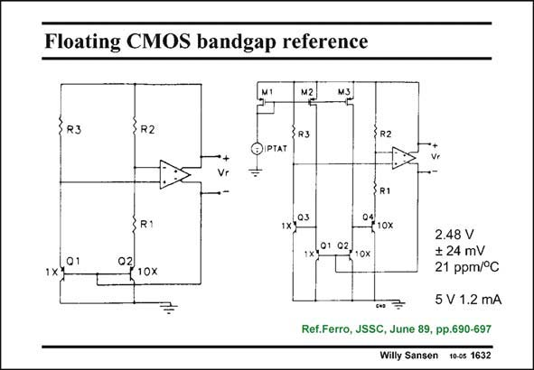

# SANSEN-1632 · Floating CMOS bandgap reference

章节：16 带隙基准与电流基准电路  
PDF 页：463；书本页：472；幻灯片编号：1632  
状态：unreviewed



## 对应教材讲解

### PDF 463 · 书本 472

Sometimes a voltage reference is required which is not referred to ground or supply voltage. It is floating. This necessitates a full-differential opamp, as shown in this slide. The principle is shown on the left. Two pairs of substrate pnp’s are used to generate a double bandgap voltage of about 2.4 V on the right. For this purpose, transistors Q1 and Q2 must be biased by a PTAT current, which is not shown here.

## 公式／性能结论候选摘录

以下为规则截取的原文，尚未逐项判读。

（未由规则找到；不代表原页没有此类内容。）

## 曲线结论候选摘录

以下为规则截取的原文，尚未逐项判读。

（未由规则找到；不代表原页没有此类内容。）

## 原文条件与近似候选摘录

以下为规则截取的原文，尚未逐项判读。

（未由规则找到；不代表原页没有此类内容。）

## 幻灯片 OCR（未校正）

```text
Floating CMOS bandgap reference
M1
{R3
R2
3 R3
+
Vr
©IPTAT
÷
3 R2
Q1
1x1
{ R1
0210x
1x)°3
SR1
°410%
1x1°1 02,
/10x
2.48 V
‡ 24 mV
21 ppm/°C
5 V 1.2 mA
Ref.Ferro, JSSC, June 89, pp.690-697
Willy Sansen 10-05 1632
```

数学上下标、分数及正负号以原图为准。电路图已保留；未核对的连接不输出成可仿真 netlist。
