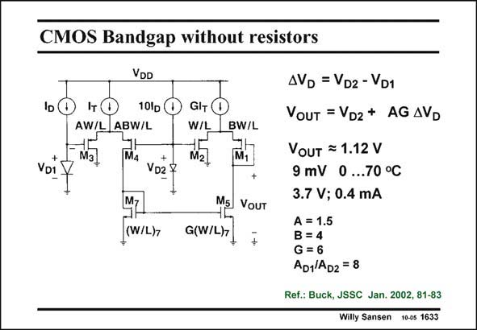

# SANSEN-1633 · CMOS Bandgap without resistors

章节：16 带隙基准与电流基准电路  
PDF 页：464；书本页：473；幻灯片编号：1633  
状态：unreviewed



## 对应教材讲解

### PDF 464 · 书本 473

It is possible to realize a bandgap reference without resistors. Actually, different sizes of MOSTs are used to amplify differences between diode voltages. Two diodes are present. A ten times larger current is pushed through the eight times smaller diode D to 2 develop a voltage difference DV , which is PTAT. This D difference is then amplified by a differential pair M3/ M4 and mirrored to the output by M7/M5. Another differential pair M1/M2 then converts this current into a voltage again. The output voltage is a result of many scaling factors A, B and G such that an appropriate PTAT voltage is added to the voltage across diode D . 2 The output voltage is little less than 1.12 V with a variation of only 9 mV over a 70°C temperature range.

## 公式／性能结论候选摘录

以下为规则截取的原文，尚未逐项判读。

（未由规则找到；不代表原页没有此类内容。）

## 曲线结论候选摘录

以下为规则截取的原文，尚未逐项判读。

（未由规则找到；不代表原页没有此类内容。）

## 原文条件与近似候选摘录

以下为规则截取的原文，尚未逐项判读。

（未由规则找到；不代表原页没有此类内容。）

## 幻灯片 OCR（未校正）

```text
CMOS Bandgap without resistors
VDD
IDC
Iт (
10lp
AW/L
ABW/L
GIT
W/L
AVD = VD2 - VD1
VOUT = VD2* AG AVD
BW/L
Ma
VD1
VD2 ₽
(W/L)7
ME VOUT
G(W/L)7
VouT = 1.12 V
9 mV 0 ...70 °C
3.7 V; 0.4 mA
A = 1.5
B = 4
G =6
AD1|AD2 = 8
Ref.: Buck, JSSC Jan. 2002, 81-83
Willy Sansen 10-0s 1633
```

数学上下标、分数及正负号以原图为准。电路图已保留；未核对的连接不输出成可仿真 netlist。
