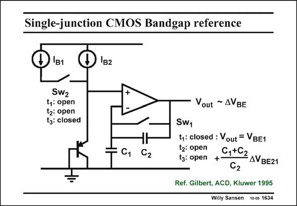

# SANSEN-1634 · Single-junction CMOS Bandgap reference

章节：16 带隙基准与电流基准电路  
PDF 页：464；书本页：473；幻灯片编号：1634  
状态：unreviewed



## 对应教材讲解

### PDF 464 · 书本 473

Mismatch between the two transistors of the PTAT cell is still a problem. This is why it is better to use the same transistor, provided it can be switched in and out. During phase 1 of the switches, the pnp transistors carries current I only. The B2 amplifier is in unity gain. The output voltage is therefore V only. BE During phase 2 of the switches, all switches are open. All voltages are now on hold. During phase 3 of the switches, the pnp transistor carries a current I +I . The transistor B1 B2 now increases its V by DV . Moreover, the opamp has now a gain, set by the two capacitors. BE BE This DV is therefore amplified and added to the output voltage held before. BE As a result, the total output voltage is the bandgap reference voltage.

## 公式／性能结论候选摘录

以下为规则截取的原文，尚未逐项判读。

- PDF 464: The B2 amplifier is in unity gain.
- PDF 464: The output voltage is therefore V only.
- PDF 464: The transistor B1 B2 now increases its V by DV .
- PDF 464: Moreover, the opamp has now a gain, set by the two capacitors.
- PDF 464: BE BE This DV is therefore amplified and added to the output voltage held before.
- PDF 464: BE As a result, the total output voltage is the bandgap reference voltage.

## 曲线结论候选摘录

以下为规则截取的原文，尚未逐项判读。

- PDF 464: During phase 1 of the switches, the pnp transistors carries current I only.
- PDF 464: BE During phase 2 of the switches, all switches are open.
- PDF 464: During phase 3 of the switches, the pnp transistor carries a current I +I .

## 原文条件与近似候选摘录

以下为规则截取的原文，尚未逐项判读。

- PDF 464: This is why it is better to use the same transistor, provided it can be switched in and out.

## 幻灯片 OCR（未校正）

```text
Single-junction CMOS Bandgap reference
D
'B2
'B1
SW2
t: open
t2: open
tg: closed
Vout ~ ДVBE
61 C2
SW1
ty: closed : Vout = VBE1
t2: open
tz: open +
C,+C2AVBE21
C2
Ref. Gilbert, ACD, Kluwer 1995
Willy Sansen 10-05 1634
```

数学上下标、分数及正负号以原图为准。电路图已保留；未核对的连接不输出成可仿真 netlist。
