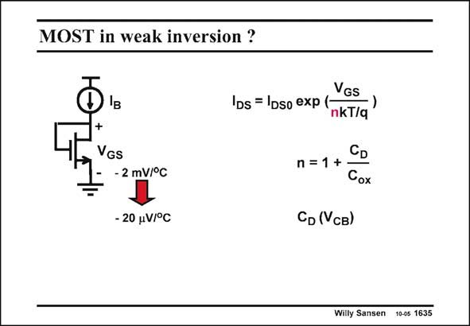

# SANSEN-1635 · MOST in weak inversion ?

章节：16 带隙基准与电流基准电路  
PDF 页：465；书本页：474；幻灯片编号：1635  
状态：unreviewed



## 对应教材讲解

### PDF 465 · 书本 474

It is clear that a MOST in weak inversion has an exponential current-voltage relation, which is nearly as good as that of a bipolar transistor. In this way the bipolar bandgap references can probably be duplicated in CMOS. There are some important differences, however. First of all, for weak inversion the currents are small and the resistors are large, which is bad for noise. Also, MOST have larger offset voltages. The errors are therefore larger as well. Also, the coefficient I does not have the same temperature coefficient as in bipolar. It is less DS0 reproducible. Finally, the exponential of this MOST in weak inversion contains a factor n, which contains a depletion capacitance, which is voltage dependent. Its value is therefore not very reproducible either. It is now clear that with MOSTs in weak inversion, the same precision can be obtained as with bipolar transistors.

## 公式／性能结论候选摘录

以下为规则截取的原文，尚未逐项判读。

- PDF 465: The errors are therefore larger as well.
- PDF 465: Finally, the exponential of this MOST in weak inversion contains a factor n, which contains a depletion capacitance, which is voltage dependent.
- PDF 465: Its value is therefore not very reproducible either.

## 曲线结论候选摘录

以下为规则截取的原文，尚未逐项判读。

（未由规则找到；不代表原页没有此类内容。）

## 原文条件与近似候选摘录

以下为规则截取的原文，尚未逐项判读。

（未由规则找到；不代表原页没有此类内容。）

## 幻灯片 OCR（未校正）

```text
MOST in weak inversion ?
+
VGs
- 2 mV/°C
- 20 V/°C
Ios = Ipso exp(-GS
nkT/q
CD
n =1 +
Cox
СD (Vсв)
Willy Sansen 10-05 1635
```

数学上下标、分数及正负号以原图为准。电路图已保留；未核对的连接不输出成可仿真 netlist。
