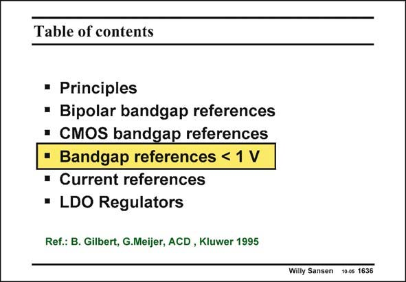

# SANSEN-1636 · Table of contents

章节：16 带隙基准与电流基准电路  
PDF 页：465；书本页：474；幻灯片编号：1636  
状态：unreviewed



## 对应教材讲解

### PDF 465 · 书本 474

As bandgap reference voltages are always 1.2 V, we can wonder how to achieve a reference voltage with value below 1 V. Indeed, the only physical constant available is this bandgap voltage. How can the properties of this bandgap voltage be exploited at lower supply voltages? The answer will lie in the conversion of this bandgap reference voltage into currents, which are then summed up to lower output reference voltages. The requirement on the supply voltage will be that we need at least one single V and some mV’s. We can bias the bipolar transistor at very low currents, which may yield BE V values down to 0.5 V. In this case, a minimum supply voltage could be reached of the same BE order of magnitude.

## 公式／性能结论候选摘录

以下为规则截取的原文，尚未逐项判读。

（未由规则找到；不代表原页没有此类内容。）

## 曲线结论候选摘录

以下为规则截取的原文，尚未逐项判读。

（未由规则找到；不代表原页没有此类内容。）

## 原文条件与近似候选摘录

以下为规则截取的原文，尚未逐项判读。

（未由规则找到；不代表原页没有此类内容。）

## 幻灯片 OCR（未校正）

```text
Table of contents
• Principles
• Bipolar bandgap references
• CMOS bandgap references
• Bandgap references < 1 V
• Current references
• LDO Regulators
Ref.: B. Gilbert, G.Meijer, ACD, Kluwer 1995
Willy Sansen 10-05 1636
```

数学上下标、分数及正负号以原图为准。电路图已保留；未核对的连接不输出成可仿真 netlist。
