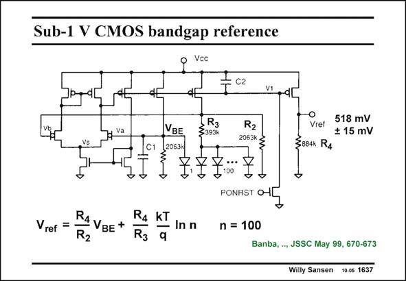

# SANSEN-1637 · Sub-1 V CMOS bandgap reference

章节：16 带隙基准与电流基准电路  
PDF 页：466；书本页：475；幻灯片编号：1637  
状态：unreviewed



## 对应教材讲解

### PDF 466 · 书本 475

The principle of a sub-1 V bandgap reference is given in this slide. The reference voltage is about 0.5 V. As a pure CMOS technology is used, only vertical pnp’s can be used. They are all represented by diodes. The operational amplifier has sufficient gain to equalize voltages Va and Vb. It is a two-stage amplifier with C2 as a compensation capacitance. Note that this is not a Miller capacitance. Also, all pMOSTs carry equal currents. Since the voltages Va and Vb are the same, the currents from these nodes to ground must be the same as well. The current through R is therefore PTAT, whereas the current through R is 3 2 simply V /R . The sum of these two currents is also flowing through the output pMOST. The BE 2 value of R then sets the output voltage. 4 The input differential pair of the opamp does not allow really low supply voltages, however. This limits the supply voltage to 2V +V . For a V of about 0.5 V this is about 1.6 V! The GS DSsat T opamp is now the limiting factor.

## 公式／性能结论候选摘录

以下为规则截取的原文，尚未逐项判读。

- PDF 466: The operational amplifier has sufficient gain to equalize voltages Va and Vb.
- PDF 466: Also, all pMOSTs carry equal currents.
- PDF 466: The current through R is therefore PTAT, whereas the current through R is 3 2 simply V /R .
- PDF 466: This limits the supply voltage to 2V +V .
- PDF 466: The GS DSsat T opamp is now the limiting factor.

## 曲线结论候选摘录

以下为规则截取的原文，尚未逐项判读。

（未由规则找到；不代表原页没有此类内容。）

## 原文条件与近似候选摘录

以下为规则截取的原文，尚未逐项判读。

（未由规则找到；不代表原页没有此类内容。）

## 幻灯片 OCR（未校正）

```text
Sub-1 V CMOS bandgap reference
Voc
C2
* va
VBE
20631
R3
33934
R2
2063k
W
Vret 518 mV
+ 15 mV
3884 R4
Vref =
RA VBE +
R4 kT
In n
R2
R3
PONRST O-
n = 100
Banba, .., JSSC May 99, 670-673
Willy Sansen 10-0s 1637
```

数学上下标、分数及正负号以原图为准。电路图已保留；未核对的连接不输出成可仿真 netlist。
