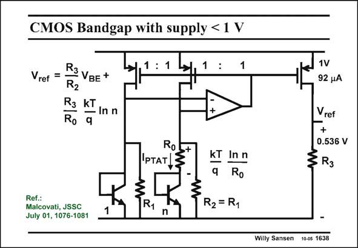

# SANSEN-1638 · CMOS Bandgap with supply < 1 V

章节：16 带隙基准与电流基准电路  
PDF 页：466；书本页：475；幻灯片编号：1638  
状态：unreviewed



## 对应教材讲解

### PDF 466 · 书本 475

In this realization, an opamp is used which operates on supply voltages below 1 V. As a result, a real sub-1V bandgap reference emerges. BiCMOS is used, however, rather than standard CMOS. The principle is similar to the one previously mentioned. The opamp equalizes its input voltages by use of feedback. This voltage is simply V . All pMOSTs BE have again equal currents. The current through resistor R is thus PTAT. It is added to a current V /R . This sum also flows through the output 0 BE 2 transistor. Resistor R then sets the output reference voltage, which is here about 0.54 V. 3 Recently, a full CMOS version has been added by the same authors (Cabrini, ESSCIRC 2005)

### PDF 467 · 书本 476

with 7 ppm/°C over −50°C to 160°C consuming only 26 mW at 1 V supply voltage. A folded cascode is then used as an opamp.

## 公式／性能结论候选摘录

以下为规则截取的原文，尚未逐项判读。

- PDF 466: As a result, a real sub-1V bandgap reference emerges.
- PDF 466: The opamp equalizes its input voltages by use of feedback.
- PDF 466: All pMOSTs BE have again equal currents.
- PDF 466: The current through resistor R is thus PTAT.

## 曲线结论候选摘录

以下为规则截取的原文，尚未逐项判读。

（未由规则找到；不代表原页没有此类内容。）

## 原文条件与近似候选摘录

以下为规则截取的原文，尚未逐项判读。

（未由规则找到；不代表原页没有此类内容。）

## 幻灯片 OCR（未校正）

```text
CMOS Bandgap with supply < 1 V
Vref =
R3VBE +
R2
R3 kT
— In n
Ro q
1 : 1
1
Roi
IpTAT l5
1V
92 4A
Vref
+
0.536 V
R3
Ref.:
Malcovati, JSSC
July 01, 1076-1081
1
R1
n
kT In n
-
q
Ro
R2 = R1
Willy Sansen 10-0s 1638
```

数学上下标、分数及正负号以原图为准。电路图已保留；未核对的连接不输出成可仿真 netlist。
