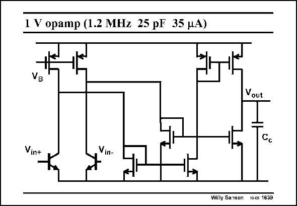

# SANSEN-1639 · 1 V opamp (1.2 MHz 25 pF 35 MA)

章节：16 带隙基准与电流基准电路  
PDF 页：467；书本页：476；幻灯片编号：1639  
状态：unreviewed



## 对应教材讲解

### PDF 467 · 书本 476

The BiCMOS opamp which operates at a supply voltage below 1 V is shown in this slide. It uses a pseudo-differential input stage. This is easy, as the input voltages are connected to the V ’s BE of the bandgap. Actually, the input transistors form current mirrors with the diode connected npn transistors of the bandgap reference. The currents are now well defined! The outputs of the input transistors lead to the output through one or two current mirrors. It is therefore a single-stage opamp. The gain is moderate, but the dominant pole is high, as indicated by the GBW. The minimum supply voltage is V +V . For a V of about 0.5 V this is only about 0.9 V. GS DSsat T

## 公式／性能结论候选摘录

以下为规则截取的原文，尚未逐项判读。

- PDF 467: It is therefore a single-stage opamp.
- PDF 467: The gain is moderate, but the dominant pole is high, as indicated by the GBW.

## 曲线结论候选摘录

以下为规则截取的原文，尚未逐项判读。

（未由规则找到；不代表原页没有此类内容。）

## 原文条件与近似候选摘录

以下为规则截取的原文，尚未逐项判读。

（未由规则找到；不代表原页没有此类内容。）

## 幻灯片 OCR（未校正）

```text
1 V opamp (1.2 MHz 25 pF 35 MA)
Vout
Cc
Vin+
Willy Sansen
10-cs 1639
```

数学上下标、分数及正负号以原图为准。电路图已保留；未核对的连接不输出成可仿真 netlist。
