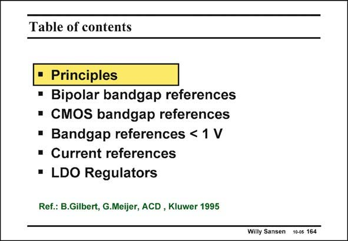

# SANSEN-164 · Table of contents

章节：16 带隙基准与电流基准电路  
PDF 页：449；书本页：458；幻灯片编号：164  
状态：unreviewed



## 对应教材讲解

### PDF 449 · 书本 458

The physics of a bipolar transistor is reviewed to examine where the absolute accuracy and temperature coefficient are coming from. A correction circuit is added to equalize the output voltage over temperature. Several realizations are now discussed in both bipolar and CMOS technologies. For supply voltages below 1 V, it is still possible to use the same principle, but some more resistors must be added. Finally, a current reference is derived from the bandgap reference, by proper use of a few resistances.

## 公式／性能结论候选摘录

以下为规则截取的原文，尚未逐项判读。

- PDF 449: A correction circuit is added to equalize the output voltage over temperature.

## 曲线结论候选摘录

以下为规则截取的原文，尚未逐项判读。

（未由规则找到；不代表原页没有此类内容。）

## 原文条件与近似候选摘录

以下为规则截取的原文，尚未逐项判读。

（未由规则找到；不代表原页没有此类内容。）

## 幻灯片 OCR（未校正）

```text
Table of contents
Principles
• Bipolar bandgap references
• CMOS bandgap references
• Bandgap references < 1 V
• Current references
• LDO Regulators
Ref.: B.Gilbert, G.Meijer, ACD, Kluwer 1995
Willy Sansen 10-0s 164
```

数学上下标、分数及正负号以原图为准。电路图已保留；未核对的连接不输出成可仿真 netlist。
