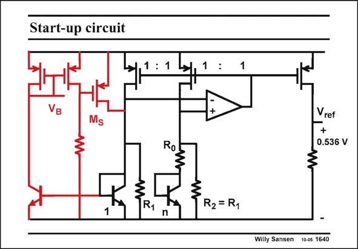

# SANSEN-1640 · Start-up circuit

章节：16 带隙基准与电流基准电路  
PDF 页：467；书本页：476；幻灯片编号：1640  
状态：unreviewed



## 对应教材讲解

### PDF 467 · 书本 476

The startup circuit is added in this slide. When the supply voltage is turned up, the resistor does not yet carry any current, and turns on transistor M . This also turns on the S bandgap reference. The npn current mirror then starts conducting and turns on the pMOST current mirror, the Gates of which are always set at a biasing voltage V .The B resistor now carries a large current, such that the Gate of M is close to the supply voltage. Transistor M is turned off again. It does not influence the S S current balance in the bandgap reference.

## 公式／性能结论候选摘录

以下为规则截取的原文，尚未逐项判读。

（未由规则找到；不代表原页没有此类内容。）

## 曲线结论候选摘录

以下为规则截取的原文，尚未逐项判读。

（未由规则找到；不代表原页没有此类内容。）

## 原文条件与近似候选摘录

以下为规则截取的原文，尚未逐项判读。

（未由规则找到；不代表原页没有此类内容。）

## 幻灯片 OCR（未校正）

```text
Start-up circuit
Ms
Ro
1
n
1
Vref
0.536 V
R2 = R1
Willy Sansen 10-05 1640
```

数学上下标、分数及正负号以原图为准。电路图已保留；未核对的连接不输出成可仿真 netlist。
