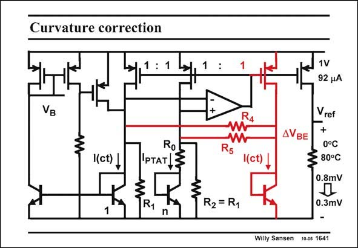

# SANSEN-1641 · Curvature correction

章节：16 带隙基准与电流基准电路  
PDF 页：468；书本页：477；幻灯片编号：1641  
状态：unreviewed



## 对应教材讲解

### PDF 468 · 书本 477

Curvature compensation is now possible. For this purpose, a diode is added and two resistors R and R . They generate 4 5 a term which subtracts the V of a junction with con- BE stant current from the V BE of a junction with the PTAT current. This term is the curvature correction. Its value is set by the two resistors. In this way, the curvature error is reduced from 0.8 mV to 0.3 mV, over 80°C.

## 公式／性能结论候选摘录

以下为规则截取的原文，尚未逐项判读。

（未由规则找到；不代表原页没有此类内容。）

## 曲线结论候选摘录

以下为规则截取的原文，尚未逐项判读。

（未由规则找到；不代表原页没有此类内容。）

## 原文条件与近似候选摘录

以下为规则截取的原文，尚未逐项判读。

（未由规则找到；不代表原页没有此类内容。）

## 幻灯片 OCR（未校正）

```text
Curvature correction
VB
((ct) L
RoT
IPTAT|≤
1
R1
n
:
R4
AVBE
R5
((ct) ,
R2 = R1
1V
92 4A
Vref
+
0°C
80°C
0.8mV
0.3mV
Willy Sansen
10-05 1641
```

数学上下标、分数及正负号以原图为准。电路图已保留；未核对的连接不输出成可仿真 netlist。
