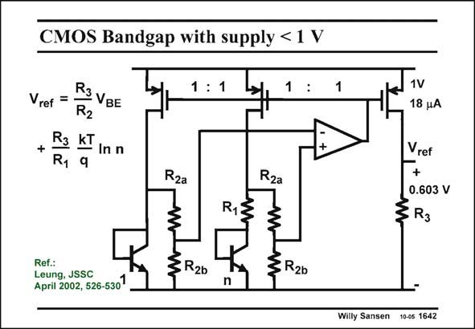

# SANSEN-1642 · CMOS Bandgap with supply < 1 V

章节：16 带隙基准与电流基准电路  
PDF 页：468；书本页：477；幻灯片编号：1642  
状态：unreviewed



## 对应教材讲解

### PDF 468 · 书本 477

In this realization another opamp is used which operates on supply voltages below 1 V. A real sub-1 V bandgap reference again emerges. Standard CMOS is used this time. The principle is similar as before. The opamp equalizes its input voltages by use of feedback. This voltage is simply V . All pMOSTs BE have again equal currents. The current through resistor R is PTAT. It is added 1 to a current V /(R +R ). BE 2a 2b This sum also flows through the output transistor. Resistor R then sets the output reference 3 voltage, which here is about 0.6 V. As an opamp, a folded cascode is used. Indeed, its input voltage range includes the ground. Also, a symmetrical OTA can be used provided low voltage current mirrors are used. Several solutions are now possible, provided an opamp can be designed, operating at the right input voltage range.

## 公式／性能结论候选摘录

以下为规则截取的原文，尚未逐项判读。

- PDF 468: The opamp equalizes its input voltages by use of feedback.
- PDF 468: All pMOSTs BE have again equal currents.

## 曲线结论候选摘录

以下为规则截取的原文，尚未逐项判读。

（未由规则找到；不代表原页没有此类内容。）

## 原文条件与近似候选摘录

以下为规则截取的原文，尚未逐项判读。

- PDF 468: Also, a symmetrical OTA can be used provided low voltage current mirrors are used.
- PDF 468: Several solutions are now possible, provided an opamp can be designed, operating at the right input voltage range.

## 幻灯片 OCR（未校正）

```text
CMOS Bandgap with supply < 1 V
Vref
R3
+
R.
R
VBE
R2
kT
9
In n
1 : 1
:
1
Rza
Rza
1V
18 uA
Vref
+
0.603 V
R13
Ref.:
Leung, JSSC
April 2002, 526-530
3R26
3R20
n
Willy Sansen 10-05 1642
```

数学上下标、分数及正负号以原图为准。电路图已保留；未核对的连接不输出成可仿真 netlist。
