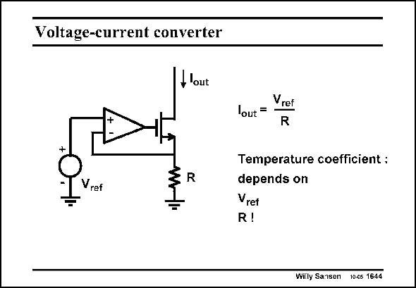

# SANSEN-1644 · Voltage-current converter

章节：16 带隙基准与电流基准电路  
PDF 页：469；书本页：478；幻灯片编号：1644  
状态：unreviewed



## 对应教材讲解

### PDF 469 · 书本 478

The most accurate way to convert a voltage into a current is the use of an opamp. The reference voltage is imposed across the resistor. The output current is exactly the same as the current through this resistor. The main error is caused by the offset of the opamp. The temperature coefficient is determined by the temperature coefficients of the bandgap reference and that of the resistor. One could be made to compensate the other, depending on the application.

## 公式／性能结论候选摘录

以下为规则截取的原文，尚未逐项判读。

- PDF 469: One could be made to compensate the other, depending on the application.

## 曲线结论候选摘录

以下为规则截取的原文，尚未逐项判读。

（未由规则找到；不代表原页没有此类内容。）

## 原文条件与近似候选摘录

以下为规则截取的原文，尚未逐项判读。

（未由规则找到；不代表原页没有此类内容。）

## 幻灯片 OCR（未校正）

```text
Voltage-current converter
flout
R
Vref
Vret
out
R
Temperature coefficient :
depends on
Vret
R!
Willy Sanson 10€6 1644
```

数学上下标、分数及正负号以原图为准。电路图已保留；未核对的连接不输出成可仿真 netlist。
