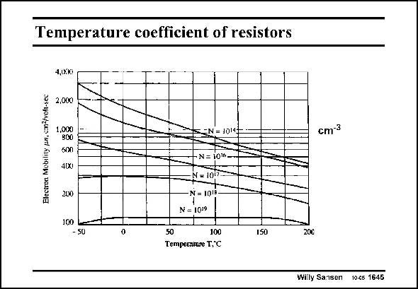

# SANSEN-1645 · Temperature coefficient of resistors

章节：16 带隙基准与电流基准电路  
PDF 页：470；书本页：479；幻灯片编号：1645  
状态：unreviewed



## 对应教材讲解

### PDF 469 · 书本 478

The temperature coefficient of a resistor strongly depends on the doping level used. Only integrated resistors in silicon are considered. Highly-doped resistors, with small sheet resistivities, have a small temperature dependence. This is shown in this slide for n-regions. Resistivity strongly depends on the mobility of the carriers. Examples are emitter regions, but also drain- and source regions in CMOS technologies. Lowly-doped resistors depend very strongly on temperature. For example the n-well resistor

### PDF 470 · 书本 479

has a strong temperature coefficient. Also, some ionimplanted resistors with high resistivity (1–2 kV/ square) have high temperature coefficients, depending a bit on the annealing used. Base resistances are somewhere in between, depending on the technology used. Also the K∞ factor in the MOST current-voltage expression contains the mobility. It decreases to some extent with temperature. A typical value is K∞~T−1.5.

## 公式／性能结论候选摘录

以下为规则截取的原文，尚未逐项判读。

- PDF 469: The temperature coefficient of a resistor strongly depends on the doping level used.
- PDF 469: Highly-doped resistors, with small sheet resistivities, have a small temperature dependence.
- PDF 469: Resistivity strongly depends on the mobility of the carriers.
- PDF 469: Lowly-doped resistors depend very strongly on temperature.
- PDF 470: Also, some ionimplanted resistors with high resistivity (1–2 kV/ square) have high temperature coefficients, depending a bit on the annealing used.
- PDF 470: Base resistances are somewhere in between, depending on the technology used.
- PDF 470: It decreases to some extent with temperature.

## 曲线结论候选摘录

以下为规则截取的原文，尚未逐项判读。

（未由规则找到；不代表原页没有此类内容。）

## 原文条件与近似候选摘录

以下为规则截取的原文，尚未逐项判读。

（未由规则找到；不代表原页没有此类内容。）

## 幻灯片 OCR（未校正）

```text
Temperature coefficient of resistors
1,0210
2,000
Electroa Mobility pn, cm2/voh
1.O
800
600
4(x)
200
=N= 10143
N= 1016-
-N - 10
N = IDis-
N= 1019
cm-3
100
- 50
50
100
Temperatare T,°C
1SD
20€
Willy Sansen 10-cs 1645
```

数学上下标、分数及正负号以原图为准。电路图已保留；未核对的连接不输出成可仿真 netlist。
