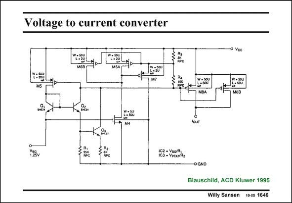

# SANSEN-1646 · Voltage to current converter

章节：16 带隙基准与电流基准电路  
PDF 页：470；书本页：479；幻灯片编号：1646  
状态：unreviewed



## 对应教材讲解

### PDF 470 · 书本 479

For precise conversion of a bandgap reference voltage to a current, the circuit in this slide can be used. A bandgap voltage of 1.25 V is applied to the input. The same bandgap voltage appears at the emitter of Q and across resistor R . 2 1 The current through Q is 2 therefore independent of temperature. The voltage at the emitter of Q and across resistor R 3 2 is PTAT, as it is a bandgap voltage minus a V . The BE current through Q is also PTAT. 3 Both currents are added and generate a voltage across R , which drives the output transistors. 4 Current feedback is applied through M5. Transistor M6 cancels the threshold voltage of the output devices. In this way, resistor R 3 does not play a role for the precision. Transistor M6 is driven by M4 and M7. Its Gate acts as a virtual ground for the voltage-to-current conversion. Transistors M6 and M8 are shown double to indicate that they are large and well matched by means of centroide layout, etc. (see Chapter 15).

## 公式／性能结论候选摘录

以下为规则截取的原文，尚未逐项判读。

- PDF 470: The same bandgap voltage appears at the emitter of Q and across resistor R . 2 1 The current through Q is 2 therefore independent of temperature.

## 曲线结论候选摘录

以下为规则截取的原文，尚未逐项判读。

（未由规则找到；不代表原页没有此类内容。）

## 原文条件与近似候选摘录

以下为规则截取的原文，尚未逐项判读。

（未由规则找到；不代表原页没有此类内容。）

## 幻灯片 OCR（未校正）

```text
Voltage to current converter
o Voc
M6S
MGA
MS
MBА
мав
YESv
AРО
13 - VeRAa
-OGND
Blauschild, ACD Kluwer 1995
Willy Sansen 1005 1646
```

数学上下标、分数及正负号以原图为准。电路图已保留；未核对的连接不输出成可仿真 netlist。
