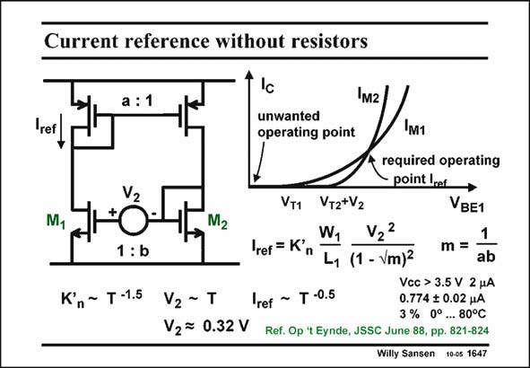

# SANSEN-1647 · Current reference without resistors

章节：16 带隙基准与电流基准电路  
PDF 页：471；书本页：480；幻灯片编号：1647  
状态：unreviewed



## 对应教材讲解

### PDF 471 · 书本 480

A current reference can also be realized without resistors. Actually, the resistive channel of a MOST will be used instead. It consists of current mirrors top-to-top. With size ratios a and b. The nMOST current mirror has an offset voltage V . In this way, the 2 only biasing points possible are at zero and at reference current I . Note that the ref bulk effect of the nMOSTs does not come in! The actual expression is given. It depends on this offset voltage V , on the ratios a and b, on the size W /L and especially 2 1 1 K∞ which contains the mobility. Needless to say that the latter one is the worst one for high precision. Moreover, the K∞ factor has a negative temperature exponent of about −1.5. If we can make V PTAT; then about −0.5 is left as the temperature exponent for the current. This is accept- 2 able indeed! How can a PTAT offset voltage V be realized by means of MOSTs? A value of about 0.32 V 2 can be realized as follows.

## 公式／性能结论候选摘录

以下为规则截取的原文，尚未逐项判读。

- PDF 471: It depends on this offset voltage V , on the ratios a and b, on the size W /L and especially 2 1 1 K∞ which contains the mobility.

## 曲线结论候选摘录

以下为规则截取的原文，尚未逐项判读。

（未由规则找到；不代表原页没有此类内容。）

## 原文条件与近似候选摘录

以下为规则截取的原文，尚未逐项判读。

（未由规则找到；不代表原页没有此类内容。）

## 幻灯片 OCR（未校正）

```text
Current reference without resistors
a: 1
M2
ref
M1
M2
1: b
K'n~ T-1.5
V2 ~ T
V2 = 0.32 V
unwanted
operating point
M1
required operating
point Iref.
VT1 VT2+V2
W,
VBE1
V22
Iref = K'
m =
L, (1 - Vm)2
ab
Vcc > 3.5 V 2 HA
Iref ~ T -0.5
0.774 $ 0.02 нA
3 % 0°... 80°C
Ref. Op 't Eynde, JSSC June 88, pp. 821-824
Willy Sansen
10-05 1647
```

数学上下标、分数及正负号以原图为准。电路图已保留；未核对的连接不输出成可仿真 netlist。
