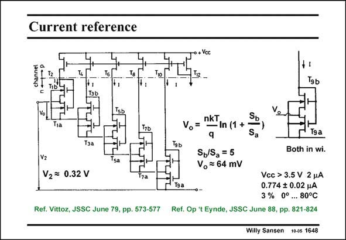

# SANSEN-1648 · Current reference

章节：16 带隙基准与电流基准电路  
PDF 页：471；书本页：480；幻灯片编号：1648  
状态：unreviewed



## 对应教材讲解

### PDF 471 · 书本 480

A fairly easy way to realize the offset voltage V2 of the previous slide is to use MOSTs in weak inversion. In the same way, as for a bipolar PTAT cell, two MOSTs are taken in weak inversion with common Gate (on the right). The lower one T serves as a 9a resistor for the upper one, however T . This is only 9b possible if the upper one is made larger, such that its V is smaller. The voltage GS difference in V , or the GS voltage across T , denoted by V , is then again PTAT. Parameter S is W/L. Voltage V is about 9a o o 64 mV for the values given. It only depends on W/L ratio’s and n. Five such cells in series then yield a reference voltage of 320 mV. This is large enough to suppress the effect of mismatches. A spreading on the current can be as low as 5%!

## 公式／性能结论候选摘录

以下为规则截取的原文，尚未逐项判读。

- PDF 471: It only depends on W/L ratio’s and n.

## 曲线结论候选摘录

以下为规则截取的原文，尚未逐项判读。

（未由规则找到；不代表原页没有此类内容。）

## 原文条件与近似候选摘录

以下为规则截取的原文，尚未逐项判读。

（未由规则找到；不代表原页没有此类内容。）

## 幻灯片 OCR（未校正）

```text
Current reference
T9b
Tra
Vo
Тза
nkT
• In (1 +
q
Sb/Sa = 5
Vo = 64 mV
Both in wi.
Vz
V2= 0.32 V
7a
Vcc > 3.5 V 2 4A
0.774 $ 0.02 4A
3 % 0° . 80°C
Ref. Vittoz, JSSC June 79, pp. 573-577 Ref. Op 't Eynde, JSSC June 88, pp. 821-824
Willy Sansen 10-05 1648
```

数学上下标、分数及正负号以原图为准。电路图已保留；未核对的连接不输出成可仿真 netlist。
