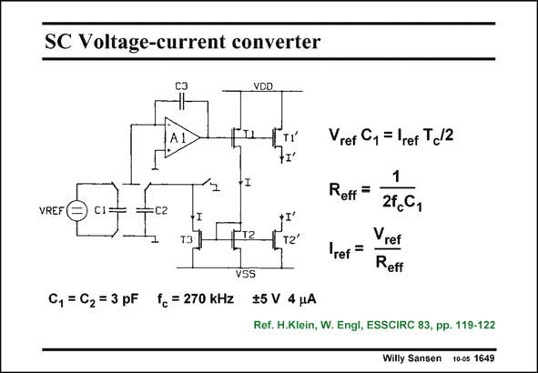

# SANSEN-1649 · SC Voltage-current converter

章节：16 带隙基准与电流基准电路  
PDF 页：472；书本页：481；幻灯片编号：1649  
状态：unreviewed



## 对应教材讲解

### PDF 472 · 书本 481

An accurate current reference can be realized without resistor if switched capacitors are used. We now know that a precise resistor can be realized by means of a switched-capacitor equivalent. This is used in the circuit in this slide. When the switches are closed as shown, the reference voltage is stored on capacitor C . Its charge is 1 then V C . ref 1 During this same time, which lasts half a clock cycle T /2, the current through T3 is discharging C , which has the same size as C . This current c 2 1 through T3 is equal to the reference current I . ref Note that both a positive and negative supply is used! When the switches are closed in the other way, the charges on C and C are made equal by 1 2 the integrator A1 with capacitor C . If not, the integrator adjusts the current through T1, T2 3 and T3, which also equals the I . ref The charges on C and C are equal in steady-state. The effective resistor is exactly as expected 1 2 for a switched-capacitor equivalent. The current is now very precise, as it only depends on a crystal oscillator clock and the absolute value of a capacitor. This is a lot more precise than the absolute value of a resistor!

## 公式／性能结论候选摘录

以下为规则截取的原文，尚未逐项判读。

- PDF 472: This current c 2 1 through T3 is equal to the reference current I . ref Note that both a positive and negative supply is used!
- PDF 472: When the switches are closed in the other way, the charges on C and C are made equal by 1 2 the integrator A1 with capacitor C .
- PDF 472: If not, the integrator adjusts the current through T1, T2 3 and T3, which also equals the I . ref The charges on C and C are equal in steady-state.
- PDF 472: The current is now very precise, as it only depends on a crystal oscillator clock and the absolute value of a capacitor.

## 曲线结论候选摘录

以下为规则截取的原文，尚未逐项判读。

（未由规则找到；不代表原页没有此类内容。）

## 原文条件与近似候选摘录

以下为规则截取的原文，尚未逐项判读。

（未由规则找到；不代表原页没有此类内容。）

## 幻灯片 OCR（未校正）

```text
SC Voltage-current converter
VOD
Vref Cy = lrer T,12
+I
VREF(
=
C1
C2
12
VSS
1
Reff =
24,C,
T2'
ref =
Vret
Reff
C, = C2 = 3 pF fc = 270 KHZ $5 V 4 uA
Ref. H.Klein, W. Engl, ESSCIRC 83, pp. 119-122
Willy Sansen 100s 1649
```

数学上下标、分数及正负号以原图为准。电路图已保留；未核对的连接不输出成可仿真 netlist。
