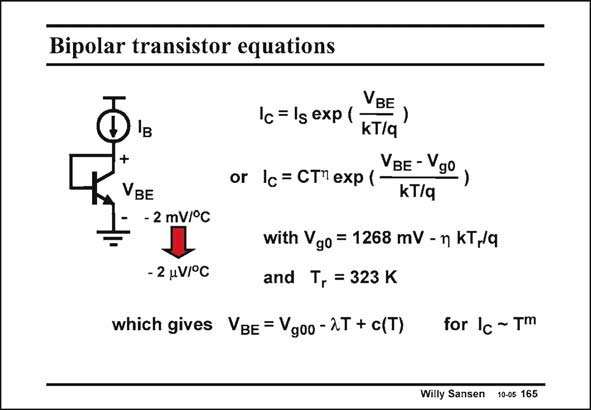

# SANSEN-165 · Bipolar transistor equations

章节：16 带隙基准与电流基准电路  
PDF 页：450；书本页：459；幻灯片编号：165  
状态：unreviewed



## 对应教材讲解

### PDF 449 · 书本 458

A bandgap reference voltage uses a bipolar transistor, connected as a diode. Its current-voltage expression is then quite accurately given by the exponential. A real pn-junction may have a coefficient of 1.05–1.1 in front of the kT/q; a bipolar-transistor connected as a diode does not. For a constant-current drive, this diode exhibits a large dependence on temperature. It is about −2 mV/°C. We intend to reduce this value to less than 1/1000th!

### PDF 450 · 书本 459

In order to do so we need an expression of the current in which the temperature is shown explicitly. The voltage V is the diode voltage g0 at zero absolute temperature (Kelvin). It depends on temperature by itself. The values are given for a reference temperature T of r 323 K or 50°C. This has been chosen to be the middle of the temperature range of interest. This is from 0 to 100°C. For this range, the values given in this slide are good empirical approximations. Parameter g is about 4. Then the actual value of V is about 1.156 V g0 (kT /q is about 28 mV). r If we want the current to be dependent on the temperature by exponent m, then the baseemitter voltage V can be written as shown in this slide. A linear dependence on the temperature BE emerges with slope l, and a correction factor c(T), called the curvature.

## 公式／性能结论候选摘录

以下为规则截取的原文，尚未逐项判读。

- PDF 449: For a constant-current drive, this diode exhibits a large dependence on temperature.
- PDF 450: It depends on temperature by itself.
- PDF 450: Then the actual value of V is about 1.156 V g0 (kT /q is about 28 mV). r If we want the current to be dependent on the temperature by exponent m, then the baseemitter voltage V can be written as shown in this slide.
- PDF 450: A linear dependence on the temperature BE emerges with slope l, and a correction factor c(T), called the curvature.

## 曲线结论候选摘录

以下为规则截取的原文，尚未逐项判读。

- PDF 450: A linear dependence on the temperature BE emerges with slope l, and a correction factor c(T), called the curvature.

## 原文条件与近似候选摘录

以下为规则截取的原文，尚未逐项判读。

- PDF 450: For this range, the values given in this slide are good empirical approximations.

## 幻灯片 OCR（未校正）

```text
Bipolar transistor equations
+
VBE
-2 mV/°C
- 2 uV/°C
VBE
Ic = lg exp (
-)
kT/q
or /c = СТ" еxр (
VBE - Ygo,
kT/q
with Vgo = 1268 mV - n kT,/q
and T, = 323 K
which gives VBE = Vgoo-2T + c(T)
for Ic ~ Tm
Willy Sansen 10-0s 165
```

数学上下标、分数及正负号以原图为准。电路图已保留；未核对的连接不输出成可仿真 netlist。
