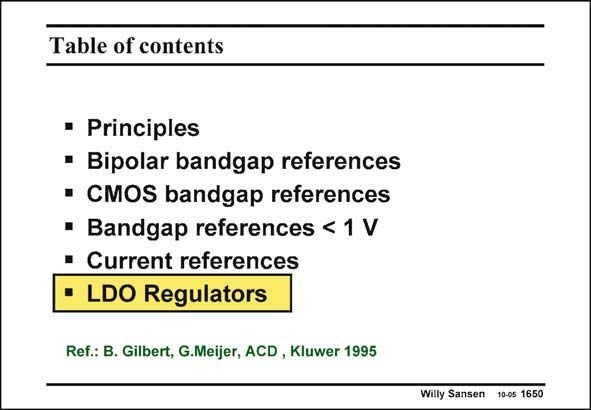

# SANSEN-1650 · Table of contents

章节：16 带隙基准与电流基准电路  
PDF 页：472；书本页：481；幻灯片编号：1650  
状态：unreviewed



## 对应教材讲解

### PDF 472 · 书本 481

Both voltage and current references have been discussed now. Both can be used in voltage and current regulators. Only one more kind of regulator will be discussed here. It is a feedback circuit with variable load. As a consequence the design is not straightforward.

## 公式／性能结论候选摘录

以下为规则截取的原文，尚未逐项判读。

（未由规则找到；不代表原页没有此类内容。）

## 曲线结论候选摘录

以下为规则截取的原文，尚未逐项判读。

（未由规则找到；不代表原页没有此类内容。）

## 原文条件与近似候选摘录

以下为规则截取的原文，尚未逐项判读。

（未由规则找到；不代表原页没有此类内容。）

## 幻灯片 OCR（未校正）

```text
Table of contents
• Principles
• Bipolar bandgap references
• CMOS bandgap references
• Bandgap references < 1 V
• Current references
• LDO Regulators
Ref.: B. Gilbert, G.Meijer, ACD, Kluwer 1995
Willy Sansen 10-05 1650
```

数学上下标、分数及正负号以原图为准。电路图已保留；未核对的连接不输出成可仿真 netlist。
