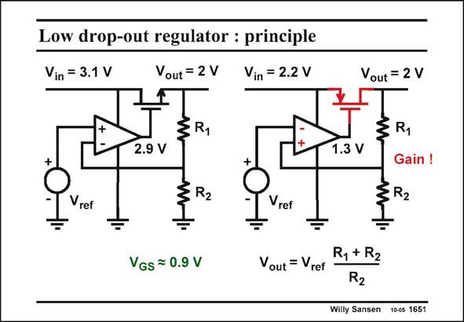

# SANSEN-1651 · Low drop-out regulator : principle

章节：16 带隙基准与电流基准电路  
PDF 页：473；书本页：482；幻灯片编号：1651  
状态：unreviewed



## 对应教材讲解

### PDF 473 · 书本 482

Both kind of regulators are shown in this slide. The left one uses the output transistor in sourcefollower configuration, the right one as an amplifier. As a consequence the right one has one more stage in the feedback loop. It is therefore much more prone to instability. It is preferred however, because the voltage drop across the output device can be smaller. Hence, the power dissipation is smaller. The stability problem is even worse noticing that the load impedance can vary greatly. Output currents can vary over three or more orders of magnitude. The equivalent load resistors vary as much. The transconductance of the output transistor varies a lot as well. Remember that the non-dominant pole is determined by this transconductance. The compensation devices will have to cover a wide range of output loads. The only way to avoid very large compensation capacitances is to try compensation schemas which track the load.

## 公式／性能结论候选摘录

以下为规则截取的原文，尚未逐项判读。

- PDF 473: It is therefore much more prone to instability.

## 曲线结论候选摘录

以下为规则截取的原文，尚未逐项判读。

（未由规则找到；不代表原页没有此类内容。）

## 原文条件与近似候选摘录

以下为规则截取的原文，尚未逐项判读。

（未由规则找到；不代表原页没有此类内容。）

## 幻灯片 OCR（未校正）

```text
Low drop-out regulator : principle
Vin = 3.1 V
Vout = 2 V
Vin = 2.2 V
Vout = 2 V
+
§R1
2.9 V
+
1.3 V
Vref
R2
R1
Gain !
R2
Vref
VGS = 0.9 V
Vout = Vref
R1+ R2
R2
Willy Sansen 10-05 1651
```

数学上下标、分数及正负号以原图为准。电路图已保留；未核对的连接不输出成可仿真 netlist。
