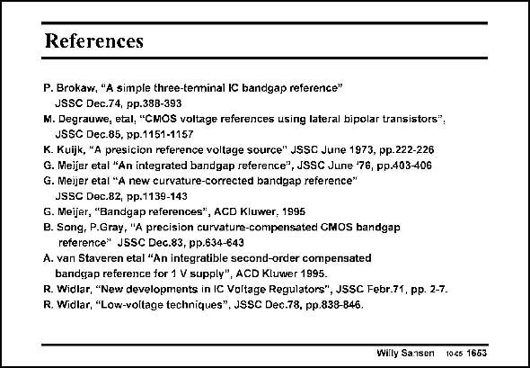

# SANSEN-1653 · References

章节：16 带隙基准与电流基准电路  
PDF 页：474；书本页：483；幻灯片编号：1653  
状态：unreviewed



## 对应教材讲解

### PDF 474 · 书本 483

Only the most important references are collected here. They are in alphabetical order. Historically, however, Widlar came first followed by Kuijk and Brokaw. Gilbert and Meijer soon followed. Many more references can be found in the IEEE Journal of Solid-State Circuits. They are left to be explored by the reader.

## 公式／性能结论候选摘录

以下为规则截取的原文，尚未逐项判读。

（未由规则找到；不代表原页没有此类内容。）

## 曲线结论候选摘录

以下为规则截取的原文，尚未逐项判读。

（未由规则找到；不代表原页没有此类内容。）

## 原文条件与近似候选摘录

以下为规则截取的原文，尚未逐项判读。

（未由规则找到；不代表原页没有此类内容。）

## 幻灯片 OCR（未校正）

```text
References
P. Brokaw, "A simple three-terminal IC bandgap reference"
JSSC Dec.74, pp.38B-393
M. Degrauwe, etal, "CMOS voltage references using lateral bipolar transistors",
JSSC Dec.85, pp.1151-1157
K. Kuljk, "A presicion reference voltage source" JSSC June 1973, pp.222-226
G. Meijer etal "An integrated bandgap reference", JSSC June '76, pp.403-406
G. Meijer etal "A new curvature-corrected bandgap reference"
JSSC Dec.82, pp.1139-143
G. Meijer, "Bandgap references", ACD Kluwer, 1995
B. Song, P.Gray, "A precision curvature-compensated CMOS bandgap
reference" JSSC Dec.83, pp.634-643
A. van Staveren etal "An integratible second-order compensated
bandgap reference for 1 V supply", ACD Kluwer 1995.
R. Widlar, "New developments in IC Voltage Regulators", JSSC Febr.71, pp. 2-7.
R. Widlar, "Low-voltage techniques", JSSC Dec.78, pp.838-846.
Willy Sansen 10c5 1653
```

数学上下标、分数及正负号以原图为准。电路图已保留；未核对的连接不输出成可仿真 netlist。
