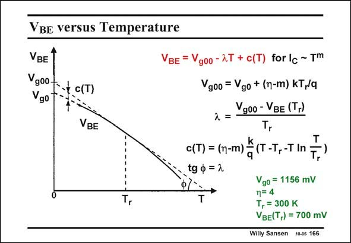

# SANSEN-166 · VBe versus Temperature

章节：16 带隙基准与电流基准电路  
PDF 页：450；书本页：459；幻灯片编号：166  
状态：unreviewed



## 对应教材讲解

### PDF 450 · 书本 459

A new zero-temperature V emerges, which is the g00 extrapolated value, as shown in this slide. It is always larger than V . For g0 a constant current (m=0), its value is about 1.268 V. It is also clear that the curvature is a complicated function of temperature but very much resembles a second-order function, a parabola. Its largest value is a zero Kelvin, and is 112 mV if m=0. It is even smaller if we allow the current to have a larger value of m. This curvature is sketched separately on the next slide.

## 公式／性能结论候选摘录

以下为规则截取的原文，尚未逐项判读。

（未由规则找到；不代表原页没有此类内容。）

## 曲线结论候选摘录

以下为规则截取的原文，尚未逐项判读。

（未由规则找到；不代表原页没有此类内容。）

## 原文条件与近似候选摘录

以下为规则截取的原文，尚未逐项判读。

（未由规则找到；不代表原页没有此类内容。）

## 幻灯片 OCR（未校正）

```text
VBe versus Temperature
VBE
900+-.t c(T)
go T-
VBE
VBE = Vgoo-2T + c(T) for Ic ~ T'™
Vg00 = Vgo + (n-m) KT,/a
Vgoo - VBE (T-)
2 =
c(T) = (n-m) _ (T-T, -T
tg р = 2
Vgo = 1156 mV
n=4
T, = 300 K
VBE(T,) = 700 mV
Willy Sansen 10-0s 166
```

数学上下标、分数及正负号以原图为准。电路图已保留；未核对的连接不输出成可仿真 netlist。
