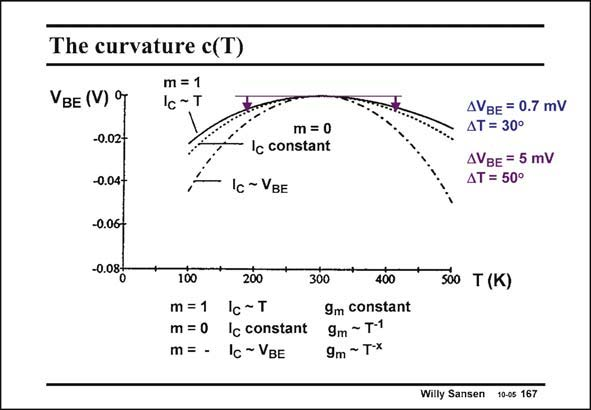

# SANSEN-167 · The curvature c(T)

章节：16 带隙基准与电流基准电路  
PDF 页：451；书本页：460；幻灯片编号：167  
状态：unreviewed



## 对应教材讲解

### PDF 450 · 书本 459

From this sketch it is clear that this curvature is not always important. For a current, which is independent of temperature (m=0), the curvature correction is only

### PDF 451 · 书本 460

about 5 mV, on 50°C distance from the reference temperature T (which is r 300 K in this example). This is of the same order of magnitude of mismatch. It is therefore negligible if the temperature range is not all that large. If we allow the current to have a positive temperature coefficient (m=1), then this curvature correction is even smaller. This is the case if we need the (bipolar transistor) transconductance g to m be independent of temperature, for example. Since, for many applications, the curvature term is negligible, let us concentrate on the linear term with coefficient l.

## 公式／性能结论候选摘录

以下为规则截取的原文，尚未逐项判读。

- PDF 450: For a current, which is independent of temperature (m=0), the curvature correction is only
- PDF 451: It is therefore negligible if the temperature range is not all that large.
- PDF 451: This is the case if we need the (bipolar transistor) transconductance g to m be independent of temperature, for example.

## 曲线结论候选摘录

以下为规则截取的原文，尚未逐项判读。

（未由规则找到；不代表原页没有此类内容。）

## 原文条件与近似候选摘录

以下为规则截取的原文，尚未逐项判读。

（未由规则找到；不代表原页没有此类内容。）

## 幻灯片 OCR（未校正）

```text
The curvature c(T)
m = 1
VBE (V) °
Ic -T
-0.02-
-0.04-
-0.06-
-0.08F
m = 0
Ic constant
Ic ~ VBE
AVBE = 0.7 mV
AT = 30°
AVBE = 5 mV
ДТ = 50°
100
200
300
400
m =1
Ic~T
9m constant
m = 0
Ic constant 9m - T•1
m = - Ic ~ VBE
9m ~T-x
Sóo T (K)
Willy Sansen 10-0s 167
```

数学上下标、分数及正负号以原图为准。电路图已保留；未核对的连接不输出成可仿真 netlist。
