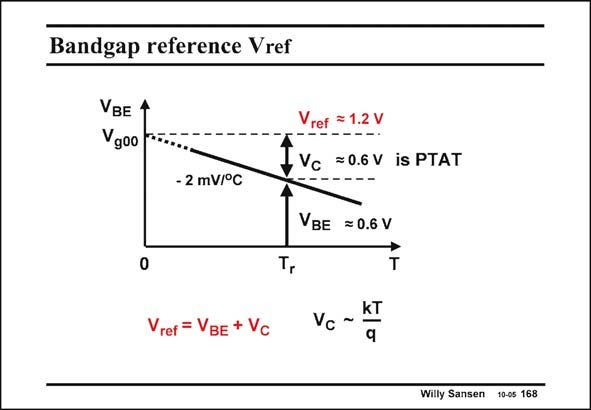

# SANSEN-168 · Bandgap reference Vref

章节：16 带隙基准与电流基准电路  
PDF 页：451；书本页：460；幻灯片编号：168  
状态：unreviewed



## 对应教材讲解

### PDF 451 · 书本 460

For a constant current, the voltage V across the BE diode-connected transistor decreases with temperature in a linear way with slope coefficient l. Its value is about −2 mV/°C. If we now find a way to add a voltage V to C this diode voltage V , BE which is Proportional To the Absolute Temperature (PTAT) with the same slope l, then we obtain a reference voltage V which is inderef pendent of temperature. Moreover, we will find that this reference voltage is the bandgap voltage itself. It provides a high absolute accuracy! Since both V and V are of similar size, the reference voltage will be around 1.2 V. Since it BE C is difficult to predict the actual voltage V , we will need to trim the added voltage V such that BE C the reference voltage is constant around our reference temperature T . This is the same as saying r that we will need to trim the added voltage V such that the curvature is symmetrical with C respect to the reference temperature T . r

## 公式／性能结论候选摘录

以下为规则截取的原文，尚未逐项判读。

- PDF 451: For a constant current, the voltage V across the BE diode-connected transistor decreases with temperature in a linear way with slope coefficient l.
- PDF 451: If we now find a way to add a voltage V to C this diode voltage V , BE which is Proportional To the Absolute Temperature (PTAT) with the same slope l, then we obtain a reference voltage V which is inderef pendent of temperature.

## 曲线结论候选摘录

以下为规则截取的原文，尚未逐项判读。

- PDF 451: For a constant current, the voltage V across the BE diode-connected transistor decreases with temperature in a linear way with slope coefficient l.
- PDF 451: If we now find a way to add a voltage V to C this diode voltage V , BE which is Proportional To the Absolute Temperature (PTAT) with the same slope l, then we obtain a reference voltage V which is inderef pendent of temperature.

## 原文条件与近似候选摘录

以下为规则截取的原文，尚未逐项判读。

（未由规则找到；不代表原页没有此类内容。）

## 幻灯片 OCR（未校正）

```text
Bandgap reference Vref
VBE 4
Vgoo
- 2 mV/°C
0
Vref = 1.2 V
e-----.
IVc =OGV isPTAT
VBE =0.6 V
T
Vref = VBE + Vc
Vc -KI
Willy Sansen 10-0s 168
```

数学上下标、分数及正负号以原图为准。电路图已保留；未核对的连接不输出成可仿真 netlist。
