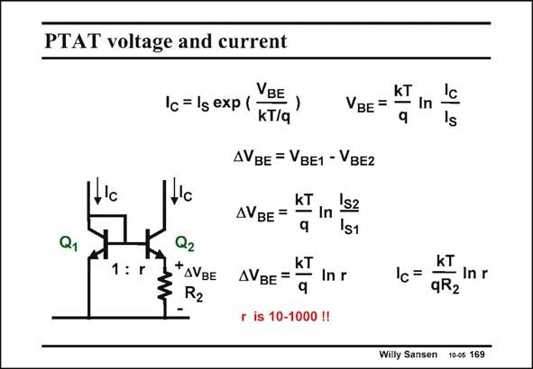

# SANSEN-169 · PTAT voltage and current

章节：16 带隙基准与电流基准电路  
PDF 页：452；书本页：461；幻灯片编号：169  
状态：unreviewed



## 对应教材讲解

### PDF 452 · 书本 461

Now let us build a voltage reference with this diode. We need to generate a circuit which provides a voltage V which is PTAT. C Such a circuit is shown in this slide. It consists of a bipolar transistor current mirror. Transistor Q2 is much larger (by a factor r) than transistor Q1 such that its V is smaller. This BE difference in voltage DV is BE taken up by a resistor R . 2 The equations show that the voltage across R is 2 PTAT. The current through it is also PTAT. Obviously, this is only true if transistor R has a 2 negligible temperature coefficient. Note also that both transistor currents I are made equal. C For example, if r=10, then DV is about 60 mV. For a resistor of R =2 kV, the currents BE 2 are 30 mA. Clearly this current must fall in the region where the exponential current voltage relationship is precisely exponential, for both transistors. The current density of the smaller transistor Q1 is much higher, which may cause some mismatch problems.

## 公式／性能结论候选摘录

以下为规则截取的原文，尚未逐项判读。

- PDF 452: Note also that both transistor currents I are made equal.

## 曲线结论候选摘录

以下为规则截取的原文，尚未逐项判读。

（未由规则找到；不代表原页没有此类内容。）

## 原文条件与近似候选摘录

以下为规则截取的原文，尚未逐项判读。

- PDF 452: Transistor Q2 is much larger (by a factor r) than transistor Q1 such that its V is smaller.

## 幻灯片 OCR（未校正）

```text
PTAT voltage and current
1'c
Q1
VBE
1c = lg exp (
-)
kT/q
kT
VBE = - In
AVBE = VBE1 - VBE2
kT
AVBE = — In
Is2
s1
1: r
Q2
*AVBE
kT
AVBE = •
- In r
q
r is 10-1000 !!
Is
kT
Ic=
= Inr
qR2
Willy Sansen 10-0s 169
```

数学上下标、分数及正负号以原图为准。电路图已保留；未核对的连接不输出成可仿真 netlist。
