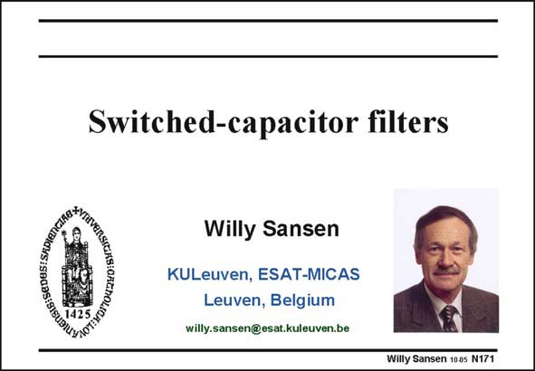

# SANSEN-171 · Slide 171

章节：17 开关电容滤波器  
PDF 页：475；书本页：485；幻灯片编号：171  
状态：unreviewed



## 对应教材讲解

### PDF 475 · 书本 485

Filters at low frequencies, such as for speech and biomedical signals, require large time constants. They can be realized either with large capacitors or with large resistors. None of them can easily be integrated, however. Switched capacitors behave like resistors with large values. As a result, they allow integration of low-frequency filters without external components. They have created a revolution in the realization of integrated low-pass filters for these applications. For this purpose, the capacitors have to be switched in and out at a clock frequency, which is much higher than the filter frequencies. Many questions arise, such as how the switching affects the filter characteristic, how much higher the clock frequency must be compared to the filter frequency, and finally, what kind of dynamic range can be achieved with such filter. These questions are answered in this Chapter.

## 公式／性能结论候选摘录

以下为规则截取的原文，尚未逐项判读。

- PDF 475: As a result, they allow integration of low-frequency filters without external components.

## 曲线结论候选摘录

以下为规则截取的原文，尚未逐项判读。

- PDF 475: Many questions arise, such as how the switching affects the filter characteristic, how much higher the clock frequency must be compared to the filter frequency, and finally, what kind of dynamic range can be achieved with such filter.

## 原文条件与近似候选摘录

以下为规则截取的原文，尚未逐项判读。

（未由规则找到；不代表原页没有此类内容。）

## 幻灯片 OCR（未校正）

```text
Switched-capacitor filters
Аареотоикао и ие
Willy Sansen
KULeuven, ESAT-MICAS
Leuven, Belgium
willy.sansen@esat.kuleuven.be
Willy Sansen 1005 N171
```

数学上下标、分数及正负号以原图为准。电路图已保留；未核对的连接不输出成可仿真 netlist。
