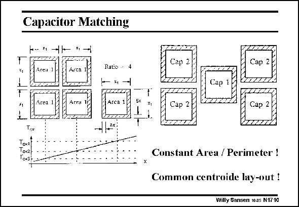

# SANSEN-1710 · Capacitor Matching

章节：17 开关电容滤波器  
PDF 页：479；书本页：489；幻灯片编号：1710  
状态：unreviewed



## 对应教材讲解

### PDF 479 · 书本 489

Matching these capacitors is of the utmost importance to achieve accurate filter frequencies. Matching capacitances has been discussed in great detail in Chapter 15. The most important conclusions are repeated here. The only way to achieve good matching between two or more capacitors is to use integer ratios of unit capacitors. They must all have the same shape, or area to perimeter ratio. They must be laid out in centroide form.

### PDF 480 · 书本 490

For example, a ratio of 4 is obtained by putting Cap1 in the middle of 4 capacitors Cap2. They now all have the same value. Moreover, the larger the unit capacitor is, the better the matching is, as shown next.

## 公式／性能结论候选摘录

以下为规则截取的原文，尚未逐项判读。

（未由规则找到；不代表原页没有此类内容。）

## 曲线结论候选摘录

以下为规则截取的原文，尚未逐项判读。

（未由规则找到；不代表原页没有此类内容。）

## 原文条件与近似候选摘录

以下为规则截取的原文，尚未逐项判读。

（未由规则找到；不代表原页没有此类内容。）

## 幻灯片 OCR（未校正）

```text
Capacitor Matching
*1
x,
Ratio - 4
Arra 1r
Ten
Тoкя
5x
Cap 2
Cap
X,
Cap 2
Cap 2
Constant Area / Perimeter !
Common centroide lay-out !
Willy Sansen 1005 N1710
```

数学上下标、分数及正负号以原图为准。电路图已保留；未核对的连接不输出成可仿真 netlist。
